# Тема 1. Введение в Python
Отчет по Теме #2 выполнил(а):
- Самков Владислав Денисович
- ИВТ-22-2

| Задание | Лаб_раб | Сам_раб |
| ------ | ------ | ------ |
| Задание 1 | + | + |
| Задание 2 | + | + |
| Задание 3 | + | + |
| Задание 4 | + | + |
| Задание 5 | + | + |
| Задание 6 | + | + |
| Задание 7 | + | + |
| Задание 8 | + | + |
| Задание 9 | + | + |
| Задание 10 | + | + |

знак "+" - задание выполнено; знак "-" - задание не выполнено;

Работу проверили:
- к.э.н., доцент Панов М.А.

## Лабораторная работа №1
### Выведите в консоль три строки. Первая – любое число. Вторая – любое число в виде строки. Третья – любое число с плавающей точкой.

```python
print(123)
print("2134")
print(1.25)
```

### Результат.
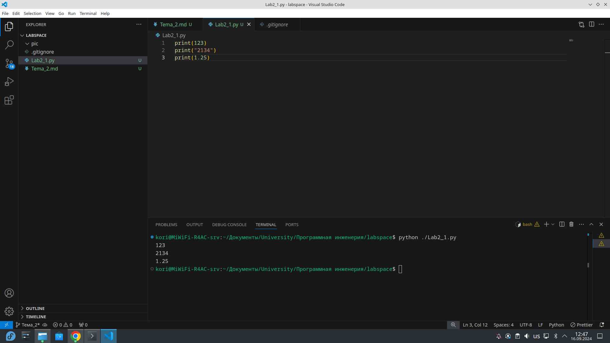

## Выводы
1. Функия print выводит значение в консоль
2. Функция print автоматически преобразует любой тип к строке

## Лабораторная работа №2
### Выведите в консоль три строки. Первая – результат сложения или вычитания минимум двух переменных типа int. Вторая – результат сложения или вычитания минимум двух переменных типа float. Третья – результат сложения или вычитания минимум двух переменных типа int и float.

```python
print(2+2)
print(2.5 - 3.2)
print(2.5 + 4)
```

### Результат.
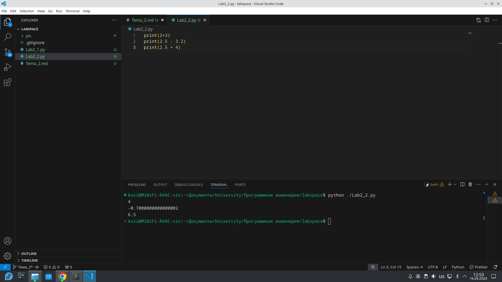

## Выводы
1. Так как python имеет динамическую типизацию и в большенстве случаев он сам реашает какой тип присвоить переменной, то в случае смешивания двух типов float и int он автоматически переводит int переменную к float и в итоге результат с типом float.
2. Во второй строке(второй print) получилось значение -0.7000000000000002. Такое происходит из-за формата хранения чисел с плавающей точкой IEEE754, который не может точно предствить некоторые десятичные дроби.  

## Лабораторная работа №3
### Выведите в консоль три строки. Первая – обычная строка. Вторая – F строка с использованием заранее объявленной переменной. Третья – сложите две или более строк в одну.

```python
print("Hello, world!")

name = "Vlad"
print(f"Hello, {name}")

a = "Hello, "
b = "world!"
print(a + b)
```

### Результат.
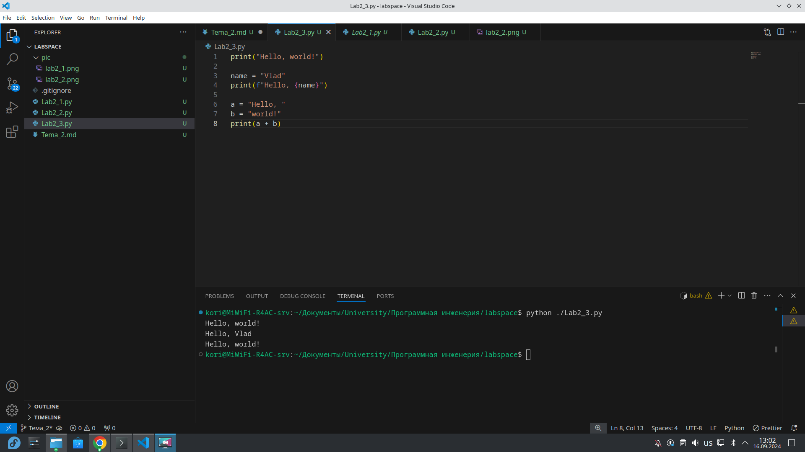

## Выводы
1. Конкатенация строк в python осуществляется при помощи знака '+'
2. Использования перменных встроке осуществляется при помощи конструкции f"Your text {variable}"

## Лабораторная работа №4
### Выведите в консоль три строки. Первая – трансформация любого типа переменной в bool. Вторая – трансформация любого типа переменной в float или int. Третья – трансформация любого типа переменной в str.

```python 
var = "Hola amigo!"
print(bool(var))

# Not working
# var2 = "Como de llamo?"
# print(float(var2))

var2 = 123
print(float(var2))

var3 = None
print(str(var3))
```

### Результат.
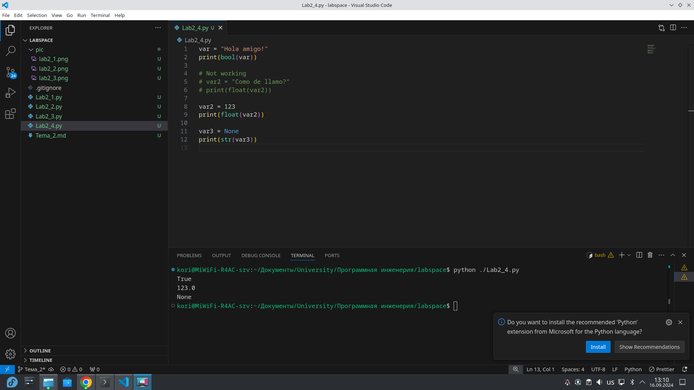

## Выводы
1. В bool type можно преобразовать перменную любого типа
2. Преобразование не пустой строки или не 0 или не None даёт true
3. Преобразовать в int или float можно число float или int, строку с числами и bool переменные 
4. В строку можно преобразовать всё, это стало известно ещё на этапе вывода переменных в косноль через print

## Лабораторная работа №5
### Присвойте трем переменным различные значения, воспользовавшись функцией input()

```python
one = input("one: ")
two = input("two: ")
three = input("three: ")
print(one, two, three)
```

### Результат.
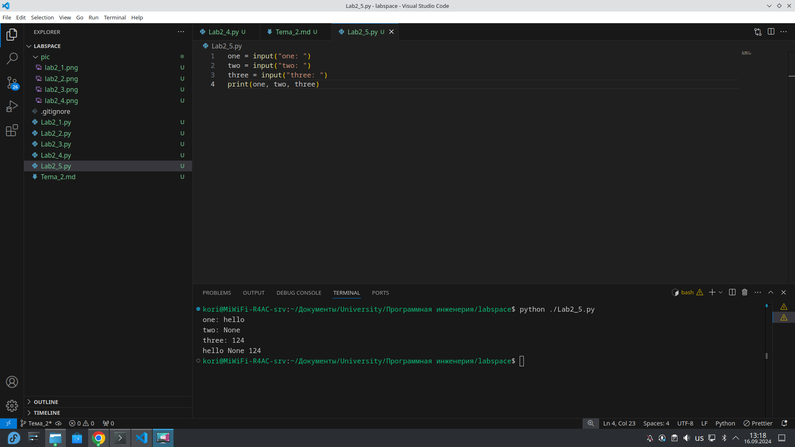

## Выводы
1. input считывает данные из консоли всегда, как строки
2. input возращает значение из консоли в переменную

## Лабораторная работа №6
### Создайте две любые числовые переменные и выполните над ними несколько математических операций: возведение в степень, обычное деление, целочисленное деление, нахождение остатка от деления. При желании вы можете проверить как работают эти вычисления с разными типами данных, например, сначала создать две переменные int, затем создать две переменные float и наконец создать переменные типа int и float и провести над ними операции, прописанные выше.

```python
a = 24
b = 15
fa = 24.5
fb = 15.2

print(a ** b)
print(fa ** fb)
print(a ** fb)

print(a / b)
print(fa / fb)
print(a / fb)

print(a // b)
print(fa // fb)
print(a // fb)

print(a % b)
print(fa % fb)
print(a % fb)
```

### Результат.
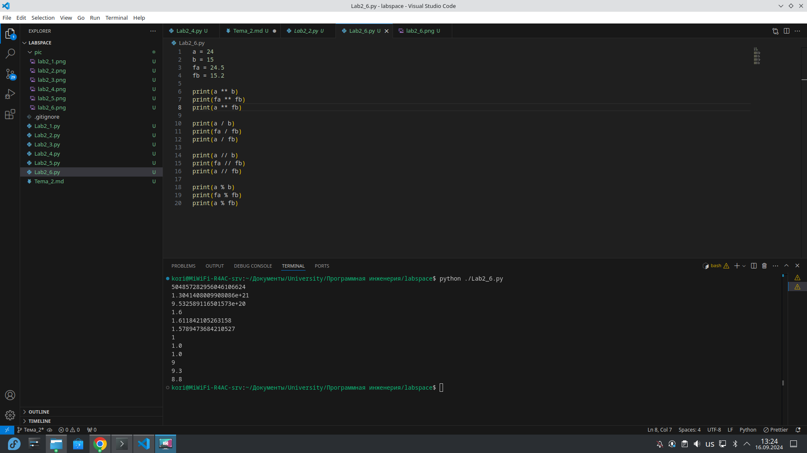

## Выводы
1. Операторы python работают как с целыми числами, так и с плавающими числами
2. Каждый операнд можнт автоматически преобразовать тип к нужному, важно следить за этим при разработке enterprise приложений

## Лабораторная работа №7
### Создайте любую строковую переменную и произведите над ней математическое действие умножение на любое число.

```python
string = "Hola amigo!"
print(string * 2)
```

### Результат.
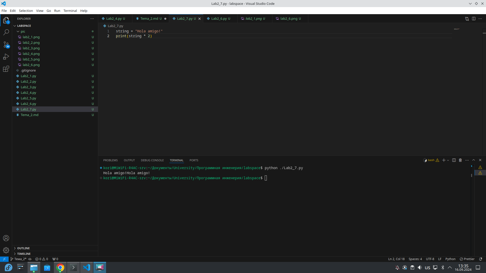

## Выводы
1. Умножение строки на число в python приводит к дублированию строки n-ое кол-во раз, при условии, что n это то число на которое мы умножаем строку.

## Лабораторная работа №8
### Посчитайте сколько раз символ ‘o’ встречается в строке ‘Hello World’.

```python 
sentence = "Hello World"
print(sentence.count('o'))
``` 

### Результат.
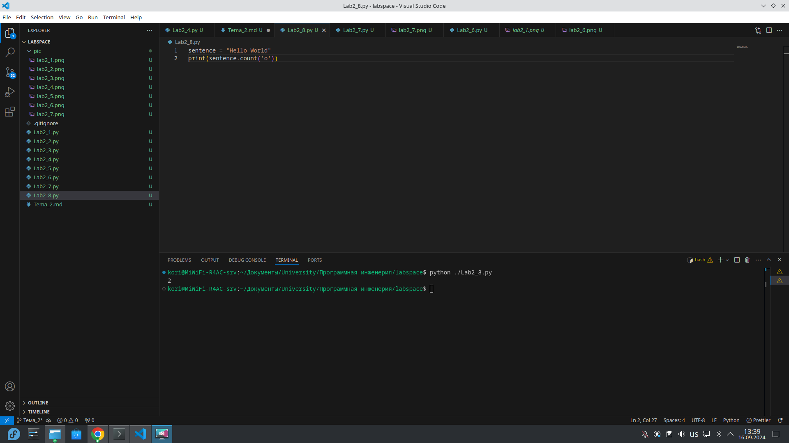

## Выводы
1. При помощи метода count из объекта string мы можем считать определённые символы в строках

## Лабораторная работа №9
### Напишите предложение ‘Hello World’ в две строки. Написанная программа должна занимать одну строку в редакторе кода

```python
print("Hello\nWorld")
```

### Результат.
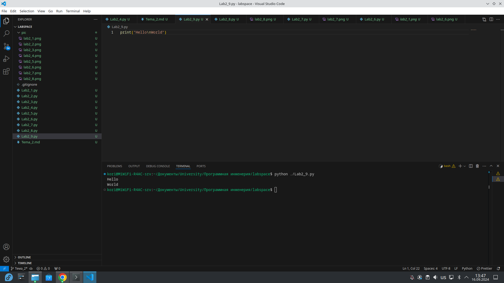

## Выводы
1. python автоматически преобразует строковые литералы

## Лабораторная работа №10
### Из предложения ‘Hello World’ выведите в консоль только 2 символ, а затем выведите слово ‘Hello’

```python
sentence = "Hello World"
print(sentence[1])
print(sentence[:5])
```

### Результат.


## Выводы
1. python предоставляет мощный инструмент slices(срезы), который позволяет обращаться к отдельным элементам, последовательностям, а также изменять их

## Самостоятельная работа №1
### Выведите в консоль булевую переменную False, не используя слово False в строке или изначально присвоенную булевую переменную. Программа должна занимать не более двух строк редактора кода.

```python
print(bool(None))
```

### Результат.
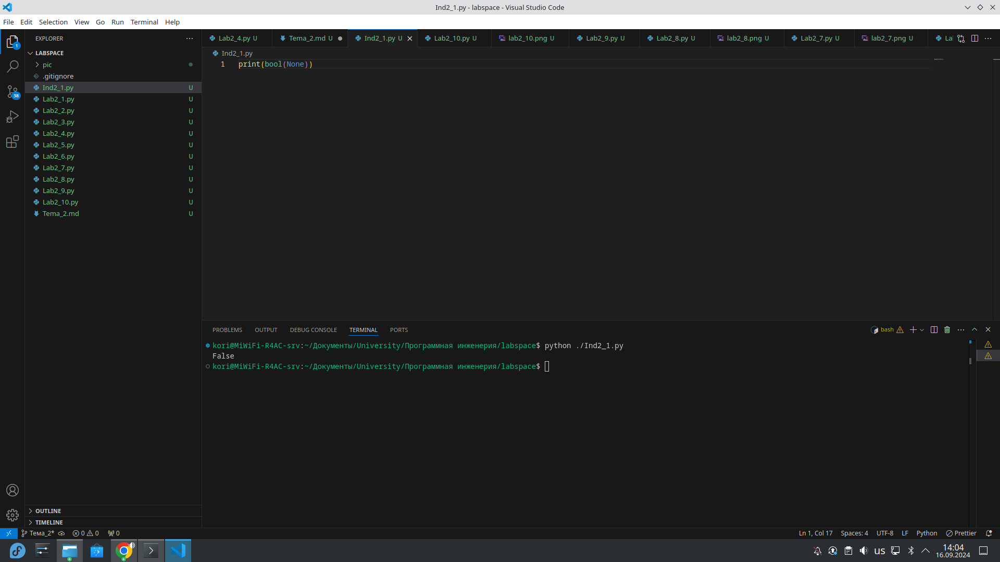

## Выводы
1. Преобразовав переменную None в bool type мы получаем False без использования строки 'Flase' и переменной со значением Flase.

## Самостоятельная работа №2
### Присвоить значения трем переменным и вывести их в консоль, используя только две строки редактора кода

```python
a, b, c = "string 1", "string 2", "strin 4214"
print(a, c, b)
```

### Результат.
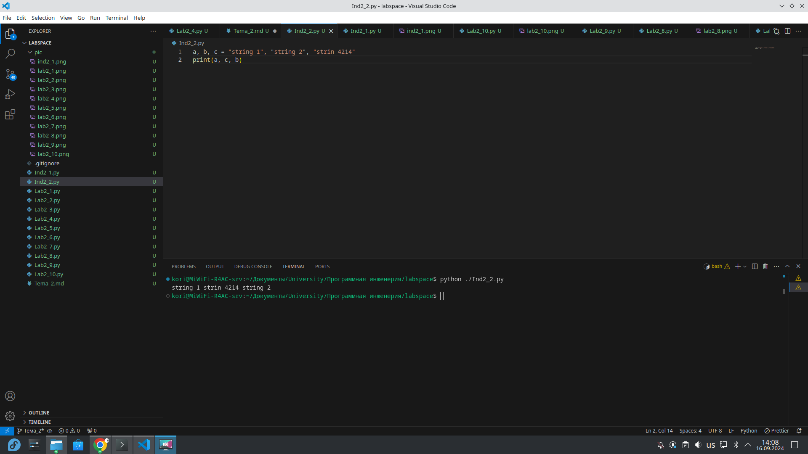

## Выводы
1. В python можно инициализировать несколько переменных в одной строке
2. У print по стандарту стоит " " разделитель

## Самостоятельная работа №3
### Реализуйте ввод данных в программу, через консоль, в виде только целых чисел (тип данных int). То есть при вводе буквенных символов в консоль, программа не должна работать. Программа должна занимать не более двух строк редактора кода.

```python
var = int(input())
print(var)
```

### Результат.
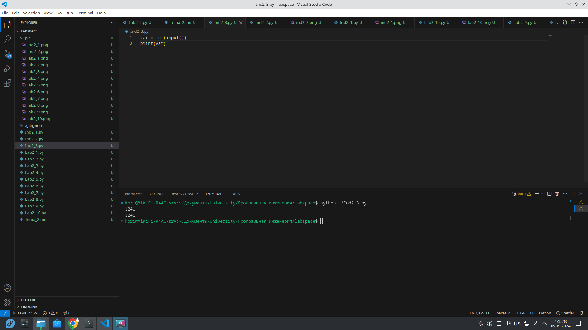

## Выводы
1. данные из input можно сразу преобразовать в int тип 

## Самостоятельная работа №4
### Создайте только одну строковую переменную. Длина строки должна не превышать 5 символов. На выходе мы должны получить строку длиной не менее 16 символов. Программа должна занимать не более двух строк редактора кода.

```python
result = '12345' * 4
print(result)
```

### Результат.
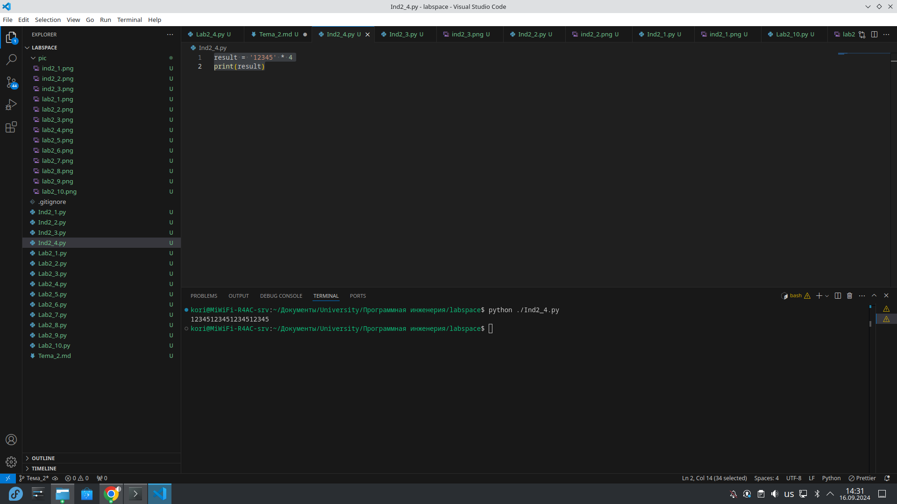

## Выводы
1. Умножая строку на число, мы получаем дублирование этой строки на n раз

## Самостоятельная работа №5
### Создайте три переменные: день (тип данных - числовой), месяц (тип данных - строка), год (тип данных - числовой) и выведите в консоль текущую дату в формате: “Сегодня день месяц год. Всего хорошего!” используя F строку и оператор end внутри print(), в котором вы должны написать фразу “Всего хорошего!”. Программа должна занимать не более двух строк редактора кода.

```python
day, month, year = 16, "september", 2024
print(f"Сегодня {day} {month} {year}.", end="Всего хорошего!\n")
```

### Результат.
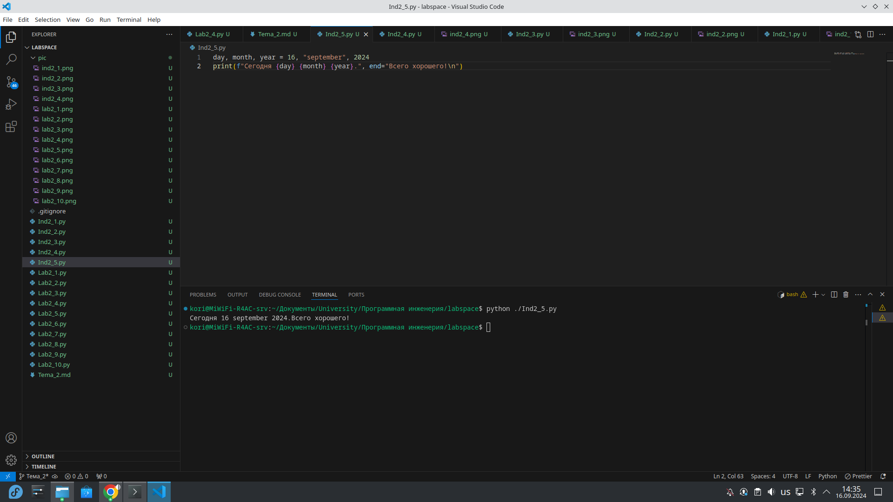

## Выводы
1. python позволяет сократить синтакси конктаинации через операнд +, через f строку.
2. параметр end у метода print устанвавливает, чем должен быть закончен вывод

## Самостоятельная работа №6
### В предложении ‘Hello World’ вставьте ‘my’ между двумя словами. Выведите полученное предложение в консоль в одну строку. Программа должна занимать не более двух строк редактора кода.

```python
string = "Hello world"
print(f"{string[:5]} my {string[6:]}")
```

### Результат.


## Выводы
1. При помощи слайсов и f строк, можно дополнить строку в python

## Самостоятельная работа №7
### Узнайте длину предложения ‘Hello World’, результат выведите в консоль. Программа должна занимать не более двух строк редактора кода

```python
string = "Hello world"
print(len(string))
```

### Результат.
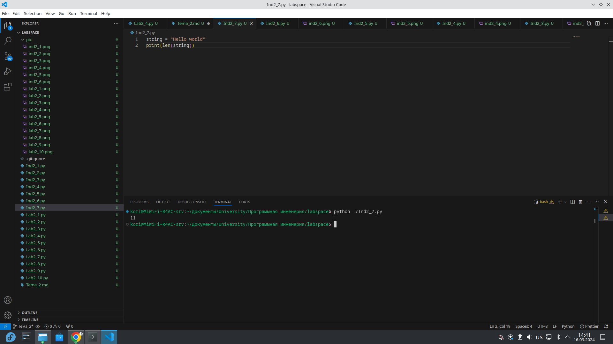

## Выводы
1. Метод len выводит длину строки. Этот метод работает не только для строк, но также и для списков(масивов), потому что строка в низкоуровневом программировании является масивом знаком

## Самостоятельная работа №8
### Переведите предложение ‘HELLO WORLD’ в нижний регистр. Программа должна занимать не более двух строк редактора кода

```python
string = "HELLO WORLD"
print(string.lower())
```

### Результат.
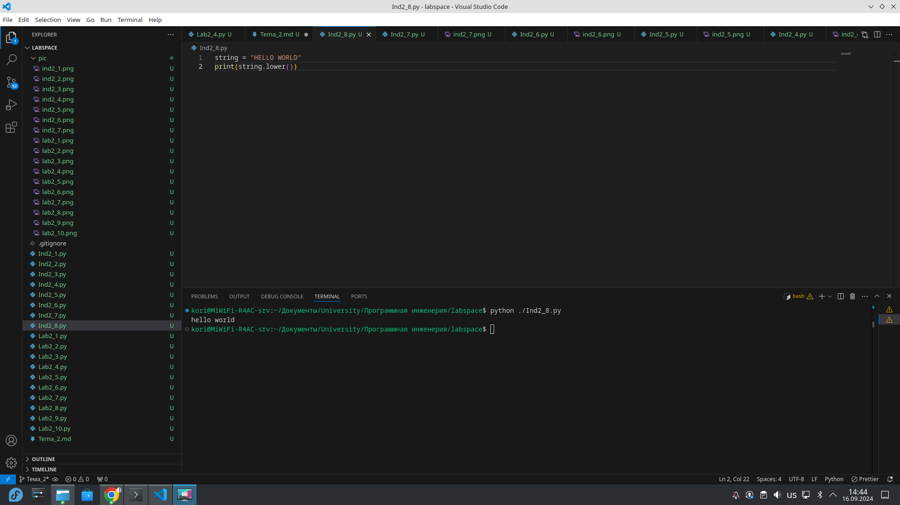

## Выводы
1. Метод lower приводит все символы в нижний регистр

## Самостоятельная работа №9
### Самостоятельно придумайте задачу по проходимой теме и решите ее. Задача должна быть связанна со взаимодействием с числовыми значениями.

### Реализация теоремы пифагора. Результат округлить до двух знаков
```python
a = 5
b = 7
c = round(pow(a**2 + b**2, 0.5), 2)
print(c)
```

### Результат.


## Выводы
1. При помощи round мы округляем число. Первый параметр - число, которое нужно округлить, второй параметр - кол-во знаков, которое должно остаться полсе запятой
2. Возведение в степень можно реализовать через метод pow или через оператор **

## Самостоятельная работа №10
### Самостоятельно придумайте задачу по проходимой теме и решите ее. Задача должна быть связанна со взаимодействием со строковыми значениями

### Дополнить строк словом my и указать начальный размер строки

```python
string = "It's string"
print(f"{string[:4]} my {string[5:]} with start len {len(string)}")
```

### Результат.
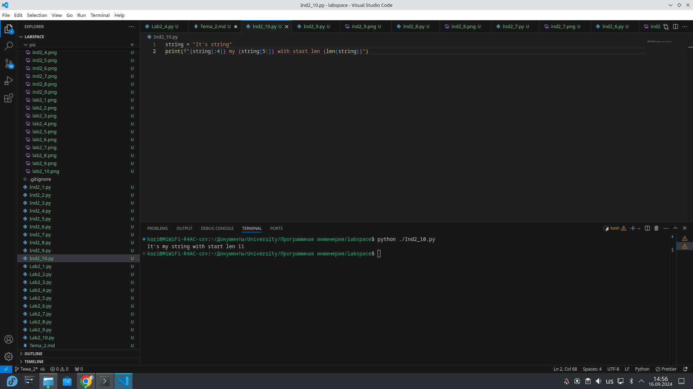

## Выводы
1. Использование слайсов и f строк значительно улучшает читаемость кода