# Тема 3. Операторы, условия, циклы
Отчет по Теме #3 выполнил(а):
- Самков Владислав Денисович
- ИВТ-22-2

| Задание | Лаб_раб | Сам_раб |
| ------ | ------ | ------ |
| Задание 1 | + | + |
| Задание 2 | + | + |
| Задание 3 | + | + |
| Задание 4 | + | + |
| Задание 5 | + | + |
| Задание 6 | + | - |
| Задание 7 | + | - |
| Задание 8 | + | - |
| Задание 9 | + | - |
| Задание 10 | + | - |

знак "+" - задание выполнено; знак "-" - задание не выполнено;

Работу проверили:
- к.э.н., доцент Панов М.А.

## Лабораторная работа №1
### Создайте две переменные, значение которых будете вводить через консоль. Также составьте условие, в котором созданные ранее переменные будут сравниваться, если условие выполняется, то выведете в консоль «Выполняется», если нет, то «Не выполняется»

```python
one = int(input('Введите значение первой переменной: '))
two = int(input('Введите значение второй переменной: '))

if one >= two:
    print('Выполняется')
else:
    print('Не выполняется')
```

### Результат.
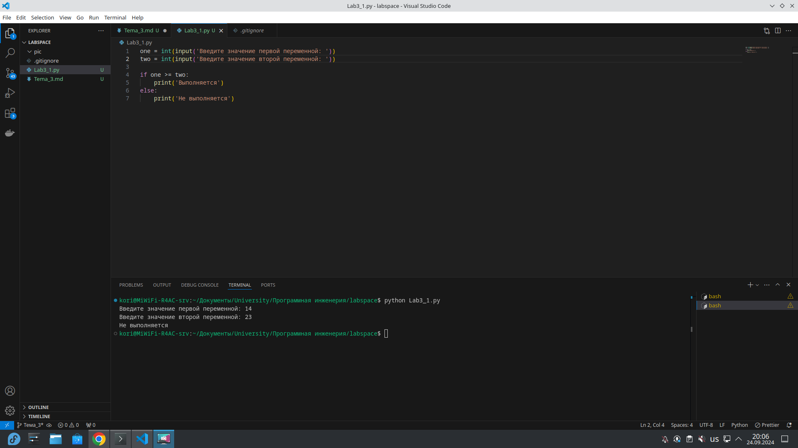

## Выводы
1. Условное выражение в python записывается через ключевое слово if

## Лабораторная работа №2
### Напишите программу, которая будет определять значения переменной меньше 0, больше 0 и меньше 10 или больше 10. Это нужно реализовать при помощи одной переменной, значение которой будет вводится через консоль, а также при помощи конструкций if, elif, else.

```python
one = int(input('Введите значение переменной: '))
if one < 0:
    print('Переменная меньше 0')
elif 0 < one < 10:
    print('Переменная больше 0 и меньше 10')
else:
    print('Переменная больше 10')
```

### Результат.
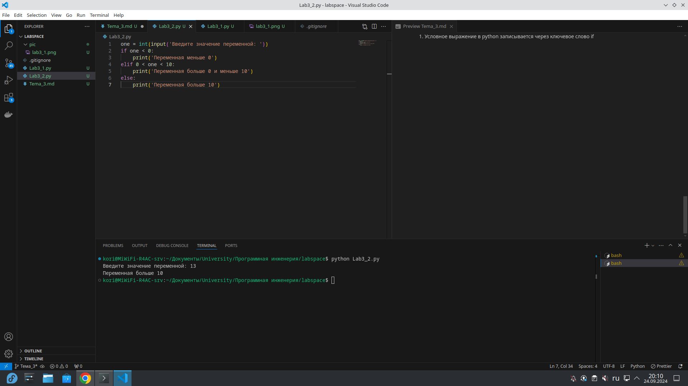

## Выводы
1. elif в python выполняет функцию дополнительного условия в условной конструкции

## Лабораторная работа №3
### Напишите программу, в которой будет проверяться есть ли переменная в указанном массиве используя логический оператор in. Самостоятельно посмотрите, как работает программа со значениями которых нет в массиве numbers.

```python
numbers = [1, 3, 4, 6, 8, 9]
value = int(input('Введите значение переменной: '))
if value in numbers:
    print('Переменная есть в данном массиве')
else:
    print('Переменной нет в этом массиве')

```

### Результат.
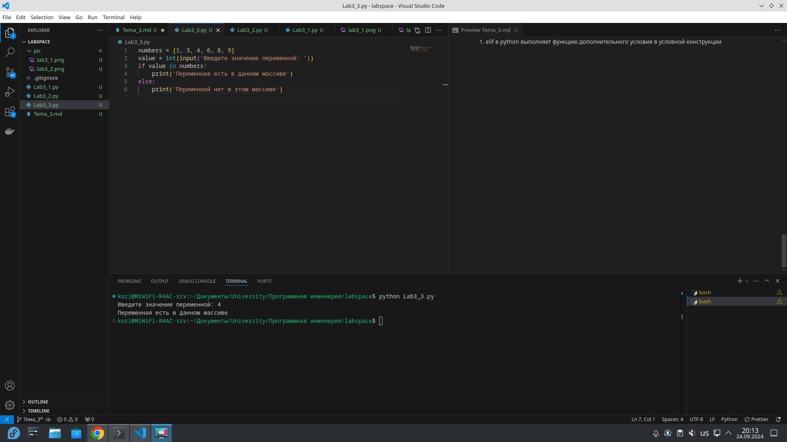

## Выводы
1. оператор in в python проверяет есть ли значение в последовательности(массиве, строке, кортеже, множестве, словаре)

## Лабораторная работа №4
### Напишите программу, которая будет определять находится ли переменная в указанном массиве и если да, то проверьте четная она или нет. Самостоятельно протестируйте данную программу с разными значениями переменной value

```python
numbers = [1, 3, 4, 6, 8, 9, 15, 16, 73, 321, 322]
value = int(input('Введите значение переменной: '))
if value in numbers:
    if value % 2 == 0:
        print('Переменная чётная и есть в массиве numbers')
    else:
        print('Переменная нечётаня и есть в массиве numbers')
else:
    print(f"Переменной нет в массиве numbers и на равна {value}")
```

### Результат.
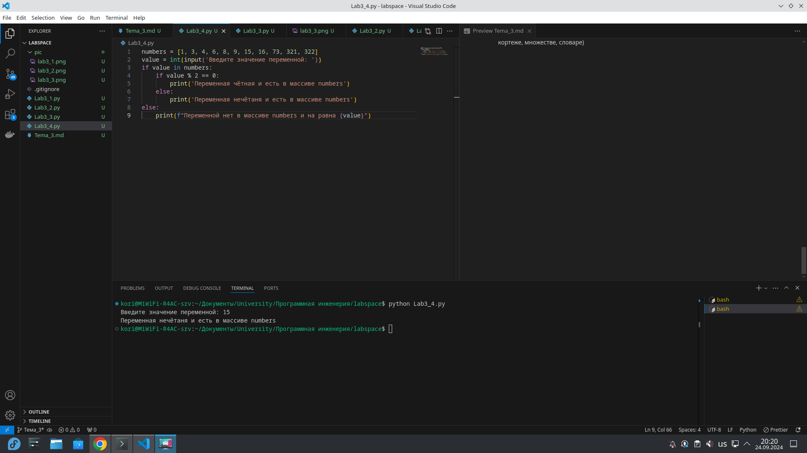

## Выводы
1. python позволяет использовать вложенные конструкции if
2. В условии python можно выполнять мат. операции

## Лабораторная работа №5
### Напишите программу, в которой циклом for значения переменной i будут меняться от 0 до 10 и посмотрите, как разные виды сравнений и операций работают в цикле.

```python
for i in range(10):
    print("i = ", i)
    if i == 0:
        i += 2
    if i == 1:
        continue
    if i == 2 or i == 3:
        print('Переменная равна 2 или 3')
    elif i in [4, 5, 6]:
        print('Переменная равна 4, 5 или 6')
    else:
        break
```

### Результат.
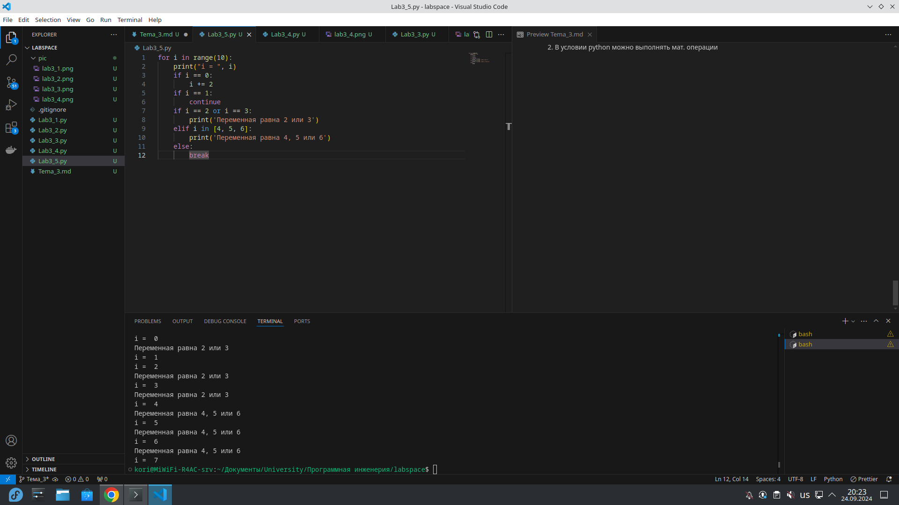

## Выводы
1. Оператор continue пропускает итерацию
2. Оператор break заканчивает цикл
3. range функция для генерации массива чисел

## Лабораторная работа №6
### Напишите программу, в которой при помощи цикла for определяется есть ли переменная value в строке string и посмотрите, как работает оператор else для циклов. Самостоятельно посмотрите, что выведет программа, если значение переменной value оказалось в строке string. Определять индекс буквы не обязательно, но если вы хотите, то это делается при помощи строки: index = string.find(value) Вы берете название переменной, в которой вы хотите что-то найти, затем применяете встроенный метод find() и в нем указываете то, что вам нужно найти. Данная строка вернет индекс искомого объекта.

```python
string = 'Привет всем изучающим Python!'
value = input()
for i in string:
    if i == value:
        index = string.find(value)
        print(f"Буква '{value}' есть в строке под {index} индексом")
        break
else:
    print(f"Буквы '{value}' нет в указанной строке")
```

### Результат.
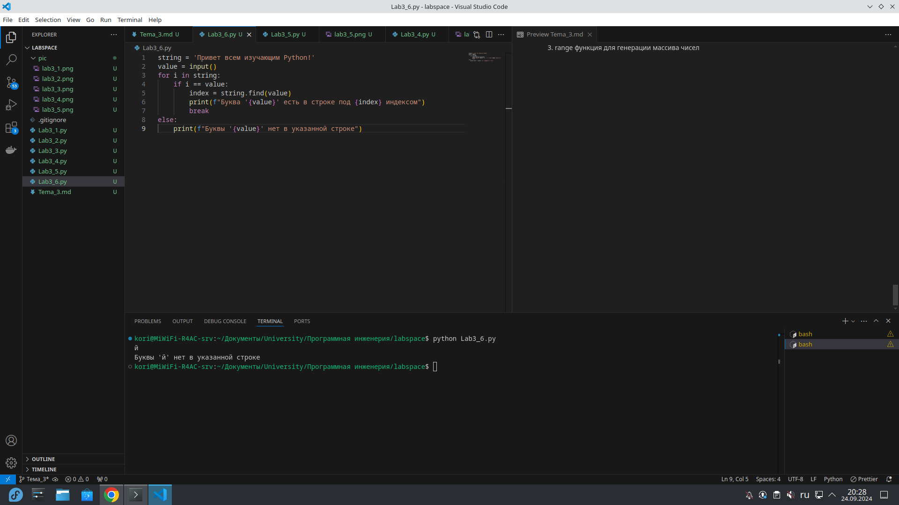

## Выводы
1. Метод find определяет индекс(положение) символа в последовательности
2. else на уровне цикла for, вызывается только в том случае, если внутренняя конструкция не вернула break

## Лабораторная работа №7
### Напишите программу, в которой вы наглядно посмотрите, как работает цикл for проходя в обратном порядке, то есть, к примеру не от 0 до 10, а от 10 до 0. В уже готовой программе показано вычитание из 100, а вам во время реализации программы будет необходимо придумать свой вариант применения обратного цикла

```python
value = 100
for i in range(10, -1, -1):
    value -= i
    print(i, value)
```

### Результат.
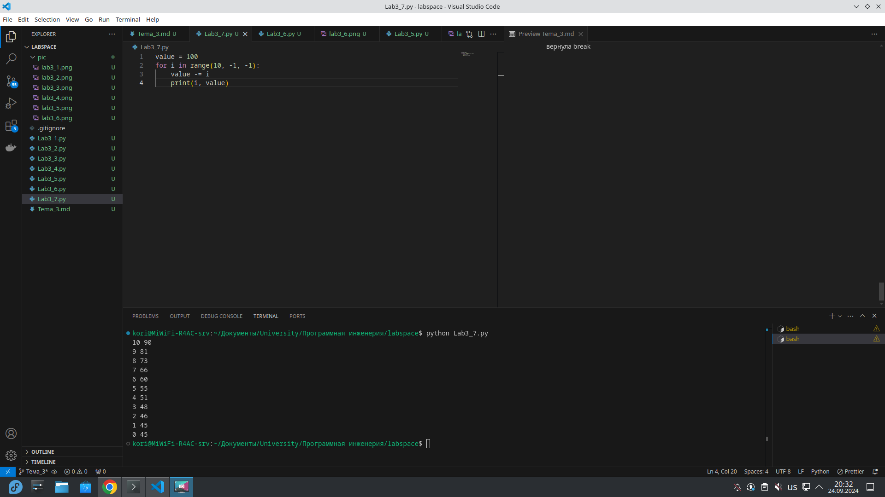

## Выводы
1. range принимает следующие значения range(start, stop, step)

## Лабораторная работа №8
### Напишите программу используя цикл while, внутри которого есть какие-либо проверки, но быть осторожным, поскольку циклы while при Михаил А. Панов неправильно написанных условиях могут становится бесконечными, как указано в примере далее.

```python
value = 0
while value < 100:
    if value == 0:
        value += 10
    elif value // 5 > 1:
        value *= 5
    else:
        value -= 5
    print(value)
```

### Результат.
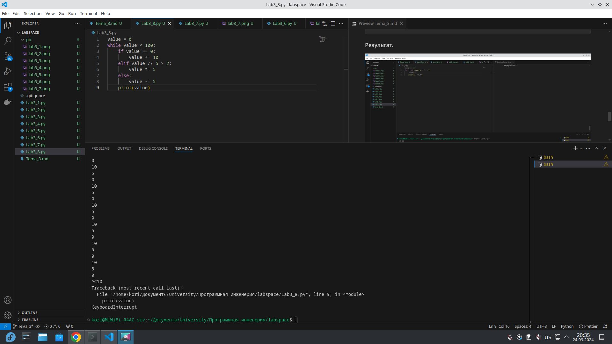


## Выводы
1. Цикл while выполняется пока передаваемое в него условие не будет True

## Лабораторная работа №9
### Напишите программу с использованием вложенных циклов и одной проверкой внутри них. Самое главное, не забудьте, что нельзя использовать одинаковые имена итерируемых переменных, когда вы используете вложенные циклы.

```python
value = 0
for i in range(10):
    for j in range(10):
        if i != j:
            value += j
        else:
            pass

print(value)
```

### Результат.
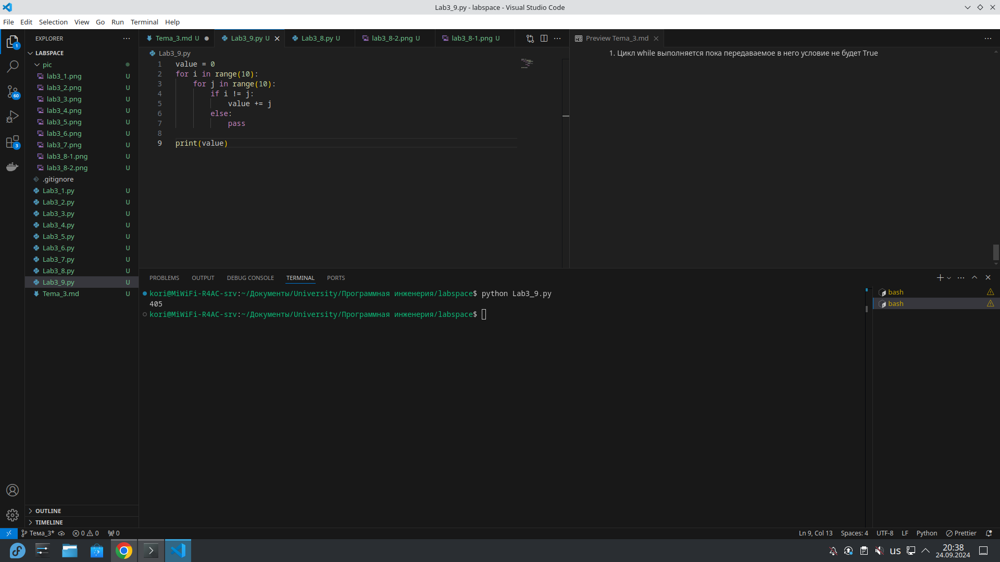

## Выводы
1. Оператор pass в python является заглушкой. Это полезно, когда ты пишешь структуру кода и планируешь добавить логику позже.

## Лабораторная работа №10
### Напишите программу с использованием flag, которое будет определять есть ли нечетное число в массиве. В данной задаче flag выступает в роли индикатора встречи нечетного числа в исходном массиве, четных чисел.

```python
even_array = [2, 4, 6, 8, 9]
flag = False
for value in even_array:
    if value % 2 == 1:
        flag = True

if flag is True:
    print('В массиве есть нечётное число')
else:
    print('В массиве все числа чётные')
```

### Результат.
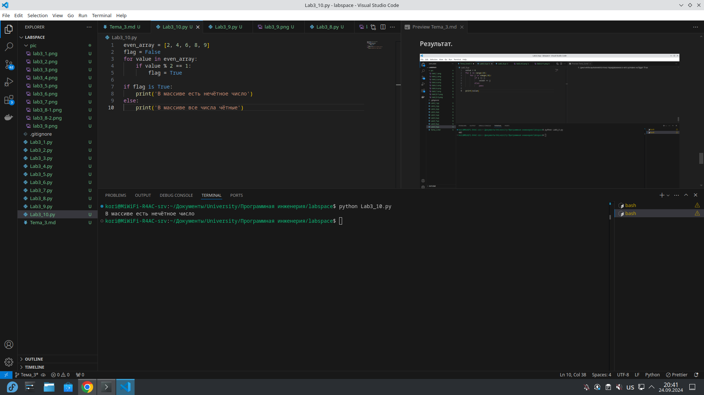

## Выводы
1. Флаг — это переменная, которая хранит логическое значение, сигнализируя, произошла ли определенная ситуация или нет. Флаги помогают контролировать выполнение программы и влиять на принятие решений в процессе работы.

## Самостоятельная работа №1
### Напишите программу, которая преобразует 1 в 31. Для выполнения поставленной задачи необходимо обязательно и только один раз использовать: • Цикл for • *= 5 • += 1 Никаких других действий или циклов использовать нельзя

```python
value = 1
for i in range(2):
    value *= 5
    value += 1

print(value)
```

### Результат.
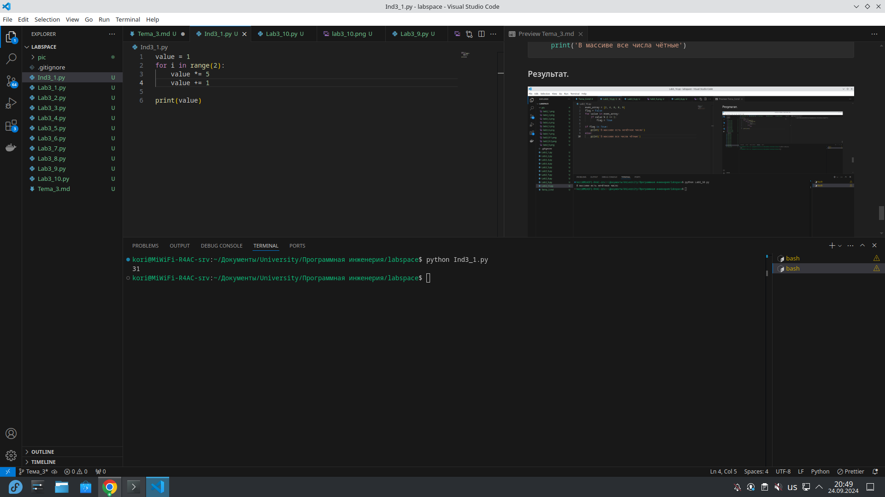

## Выводы
1. Преобразовали 1 в 31 эффективным способом

## Самостоятельная работа №2
### Напишите программу, которая фразу «Hello World» выводит в обратном порядке, и каждая буква находится в одной строке консоли. Пример вывода в консоль: При этом необходимо обязательно использовать любой цикл, а также программа должна занимать не более 3 строк в редакторе кода.

```python
value = 'Hello World'
for i in range(len(value)):
    print(value[-(i + 1)])
```

### Результат.
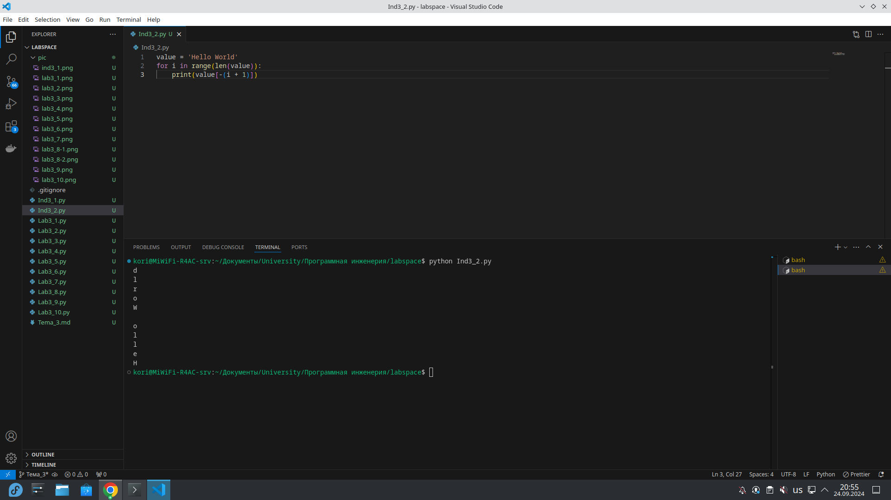

## Выводы
1. Используя отрицательный индекс, мы можем получить обратную последовательность букв

## Самостоятельная работа №3
### Напишите программу, на вход которой поступает значение из консоли, оно должно быть числовым и в диапазоне от 0 до 10 включительно (это необходимо учесть в программе). Если вводимое число не подходит по требованиям, то необходимо вывести оповещение об этом в консоль и остановить программу. Код должен вычислять в каком диапазоне находится полученное число. Нужно учитывать три диапазона: • от 0 до 3 включительно • от 3 до 6 • от 6 до 10 включительно Результатом работы программы будет выведенный в консоль диапазон. Программа должна занимать не более 10 строчек в редакторе кода.

```python
value = int(input('Введите число от 0 до 10: '))
if value >= 0 and value <= 3:
    print('Диапазон от 0 до 3')
elif value > 3 and value <= 6:
    print('Диапазон от 4 до 6')
elif value > 6 and value <= 10:
    print('Диапазон от 7 до 10')
else:
    print('Значение за диапазоном 0-10')
```

### Результат.
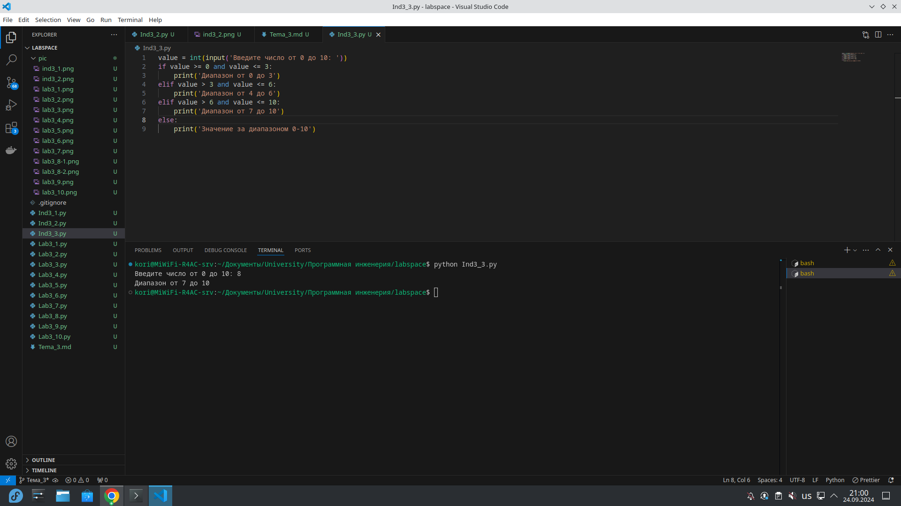

## Выводы
1. Используя условные конструкции, мы определили диапазон, в котором находится число

## Самостоятельная работа №4
### Манипулирование строками. Напишите программу на Python, которая принимает предложение (на английском) в качестве входных данных от пользователя. Выполните следующие операции и отобразите результаты: • Выведите длину предложения. • Переведите предложение в нижний регистр. • Подсчитайте количество гласных (a, e, i, o, u) в предложении. • Замените все слова "ugly" на "beauty". • Проверьте, начинается ли предложение с "The" и заканчивается ли на "end". Проверьте работу программы минимум на 3 предложениях, чтобы охватить проверку всех поставленных условий

```python
value = input("Write something: ")
print(len(value))

lowercase_sentence = value.lower()
print(lowercase_sentence)

vowels = 'aeiou'
print(sum(1 for char in lowercase_sentence if char in vowels))

replaced_sentence = lowercase_sentence.replace("ugly", "beauty")
print(replaced_sentence)

starts_with_the = value.startswith("The")
ends_with_end = value.endswith("end")
print(f"Начинается с 'The': {starts_with_the}")
print(f"Заканчивается на 'end': {ends_with_end}")
```

### Результат.
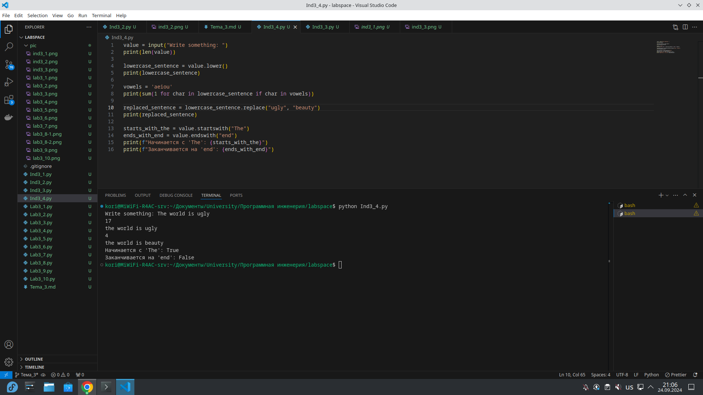

## Выводы
1. Используя строковые методы, мы можем произвести синтаксическую оценку предложения, как в данном задании

## Самостоятельная работа №5
### Составьте программу, результатом которой будет данный вывод в консоль:

```python
string = 'hello'
values = [0, 2, 4, 6, 8, 10]
counter = 0

while " world" not in string:
    memory = string
    if counter in values:
        string = string + " world"
    print(string)
    if counter < 10:
        string = memory
    counter += 1
```

### Результат.
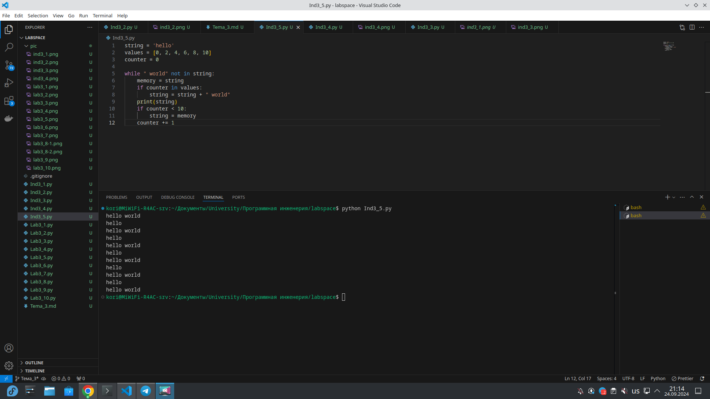

## Выводы
1. При помощи цикла while мы вывели последовательность слов ```hello world``` и ```hello```