# Тема 4. Функции и модули
Отчет по Теме #4 выполнил(а):
- Самков Владислав Денисович
- ИВТ-22-2

| Задание | Лаб_раб | Сам_раб |
| ------ | ------ | ------ |
| Задание 1 | + | + |
| Задание 2 | + | + |
| Задание 3 | + | + |
| Задание 4 | + | + |
| Задание 5 | + | + |
| Задание 6 | + | - |
| Задание 7 | + | - |
| Задание 8 | + | - |
| Задание 9 | + | - |
| Задание 10 | + | - |

знак "+" - задание выполнено; знак "-" - задание не выполнено;

Работу проверили:
- к.э.н., доцент Панов М.А.


## Лабораторная работа №1
### Напишите функцию, которая выполняет любые арифметические действия и выводит результат в консоль. Вызовите функцию используя "Точку входа"

```python
def main():
    print(2*4)

if __name__ == '__main__':
    main()
```

### Результат.
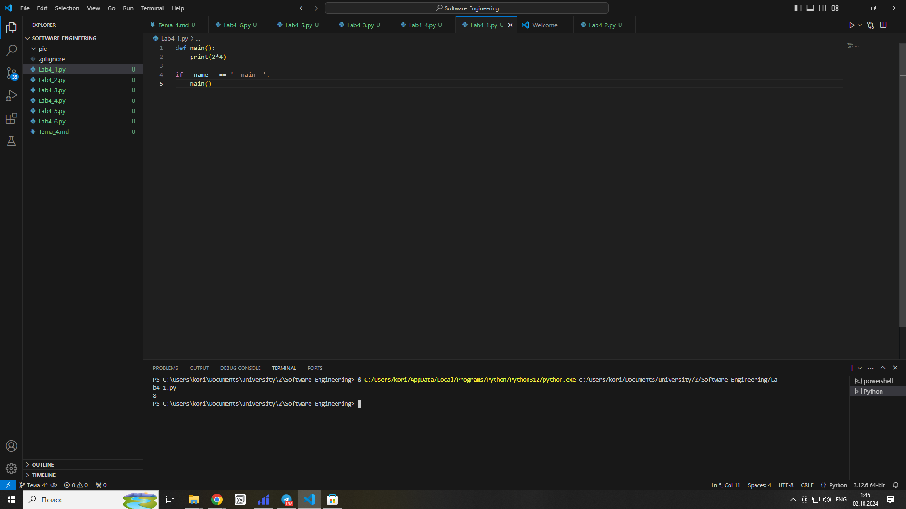

## Выводы
1. Функция определяется в начале программы и может быть вызвана в любой момент

## Лабораторная работа №2
### Напишите функцию, которая выполняет любые арифметические действия, возвращает при помощи ```return``` в место, откуда вызывали функцию. Выведите результат в консоль. Вызовите функцию используя "Точку входа"

```python
def main():
    return 2*4

if __name__ == '__main__':
    print(main())
```

### Результат.
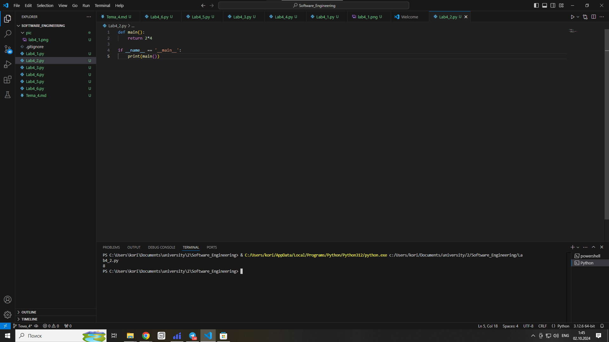

## Выводы
1. При помощи ```return``` можно возвращать значения из функции 

## Лабораторная работа №3
### Напишите функцию, в которую передаются два аргумента, над ними производится арифметическое действие, результат возвращается туда, откуда эту функцию вызывали. Выведите результат в консоль. Вызовите функцию в любом небольшом цикле.

```python
def main(a,b):
    return a*b

for i in range(5):
    a=2
    b=4
    ans=main(a,b)
    print (ans)
```

### Результат.


## Выводы
1. В функцию можно передавать значения

## Лабораторная работа №4
### Напишите функцию, на вход которой подается какое-то изначальное неизвестное количество аргументов, над которыми будет производится арифметические действия. Для выполнения задания необходимо использовать кортеж ```*args```.

```python 
def main(x,*args):
    one=x
    two=sum(args)
    three=len(args)
    print(f"one={one}, two={two}, three={three}")
    return x+sum(args)/len(args)

if __name__ == '__main__':
    res=main(1,2,5,4,3,6,7,8,9,0)
    print(f"\nresult={res}")
```

### Результат.
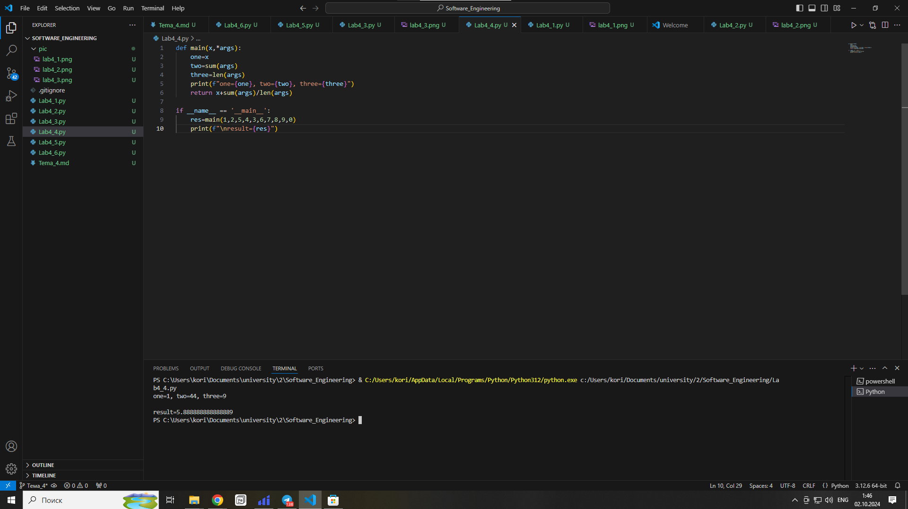

## Выводы
1. При помощи кортежа можно передавать в функцию произвольное число аргументов

## Лабораторная работа №5
### Напишите функцию, которая на вход получает кортеж ```**kwargs``` и при помощи цикла выводит значения, поступившие в функцию.

```python
def main(**kwargs):
    for i in kwargs.items():
        print(i[0], i[1])
    print()
    for key in kwargs:
        print(f"{key}={kwargs[key]}")

if __name__ == '__main__':
    main(x=[1,2,3],y=[3,3,0],z=[2,3,0],q=[3,3,0],w=[3,3,0])
```

### Результат.
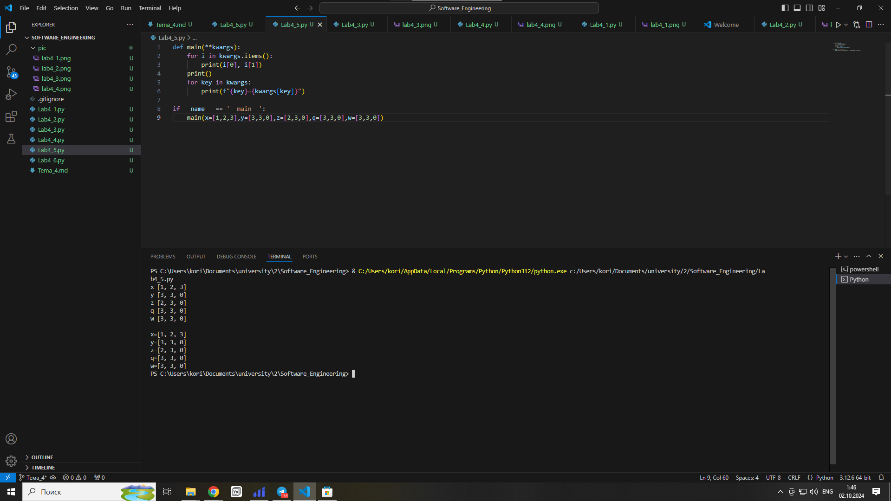

## Выводы
1. Кортеж ```**kwargs``` позволяет передавать произвольное количество ключей и данных

## Лабораторная работа №6
### Напишите две функции. Первая – получает в виде параметра “**kwargs”. Вторая считает среднее арифметическое из значений первой функции. Вызовите первую функцию используя “точку входа” и минимум 4 аргумента.

```python
def main(**kwargs):
    for i,j in kwargs.items():
        print(f"{i} mean {mean(j)}")

def mean(data):
    return sum(data)/len (data)

if __name__ == '__main__':
    main(x=[1,2,3],y=[3,3,0])
```

### Результат.
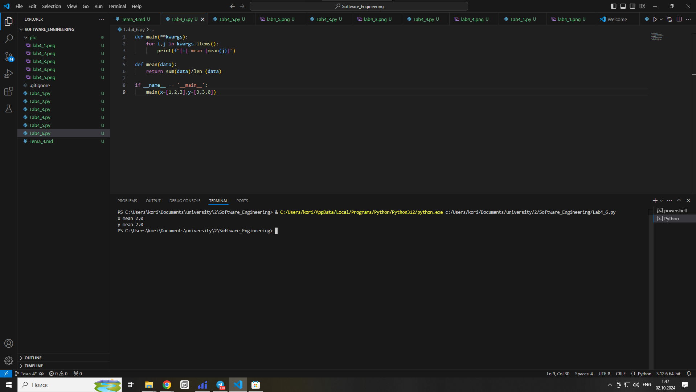

## Выводы
1. Из функции можно передавать данные в другую функцию

## Лабораторная работа №7
### Создайте дополнительный файл .py. Напишите в нем любую функцию, которая будет что угодно выводить в консоль, но не вызывайте ее в нем. Откройте файл main.py, импортируйте в него функцию из нового файла и при помощи “точки входа” вызовите эту функцию

```python
from abca import say_hello

if __name__ == '__main__':
    say_hello()
```

```python
def say_hello():
    print("hello")
```

### Результат.
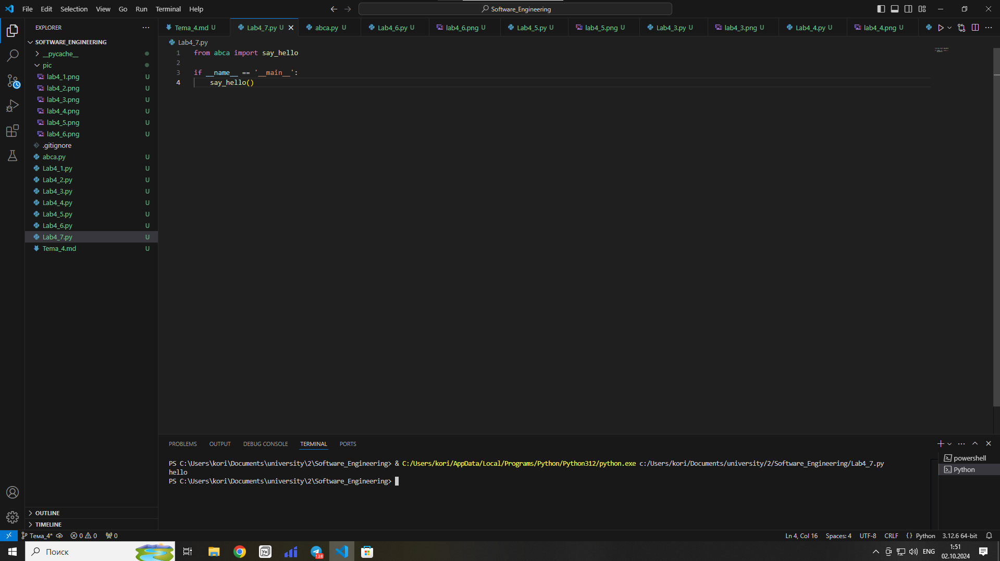

## Выводы
1. Команда ```import``` позволяет импортировать функции из других файлов

## Лабораторная работа №8
### Напишите программу, которая будет выводить корень, синус, косинус полученного от пользователя числа

```python 
import math

def main():
    value = int(input("Введите значение: "))
    print(math.sqrt(value))
    print(math.sin(value))
    print(math.cos(value))

if __name__ == '__main__':
    main()
``` 

### Результат.
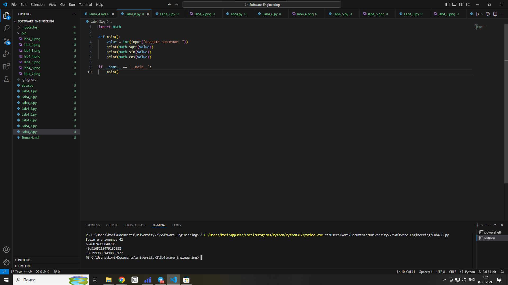

## Выводы
1. Библиотека ```math``` включает в себя математические операции
2. Команда ```import``` позволяет импортировать бибилиотеки

## Лабораторная работа №9
### Напишите программу, которая будет рассчитывать какой день недели будет через n-нное количество дней, которые укажет пользователь.

```python
from datetime import datetime as dt
from datetime import timedelta as td

def main():
    print(
        f"Сегодня - {dt.today().date()}. "
        f"День недели - {dt.today().isoweekday()}"
        )
    n=int(input())
    today=dt.today()
    result=today+td(days=n)
    print(
        f"Через {n} дней будет {result.date()}. "
        f"День недели - {result.isoweekday()}"
    )

if __name__ == '__main__':
    main()
```

### Результат.
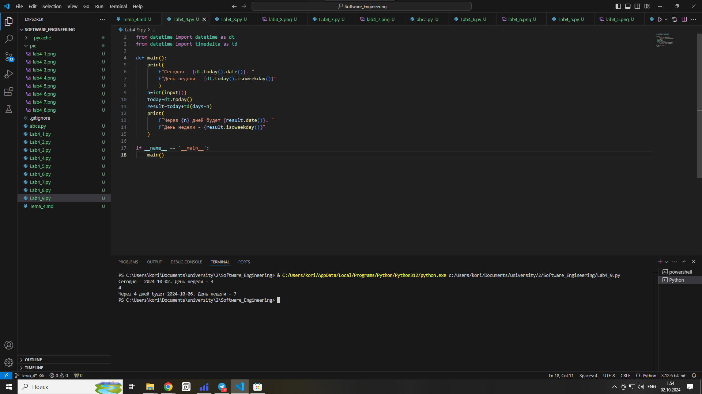

## Выводы
1. Библиотека ```datetime``` содержит в себе операции со временем
2. Команда ```import``` позволяет импортировать отдельно выбранные функции и задавать им имена

## Лабораторная работа №10
### 10)	Напишите программу с использованием глобальных переменных, которая будет считать площадь треугольника или прямоугольника в зависимости от того, что выберет пользователь. Получение всей необходимой информации реализовать через input(), а подсчет площадей выполнить при помощи функций. Результатом программы будет число, равное площади, необходимой фигуры.

```python
global result

def rectangle():
    a=float(input("Ширина: "))
    b=float(input("Высота: "))
    global result
    result = a*b

def triangle():
    a=float(input("Основание: "))
    h=float(input("Высота: "))
    global result
    result = a*h

figure=input()

if figure=="1":
    rectangle()
if figure=="2":
    triangle()
print (f"Площадь: {result}")
```

### Результат.
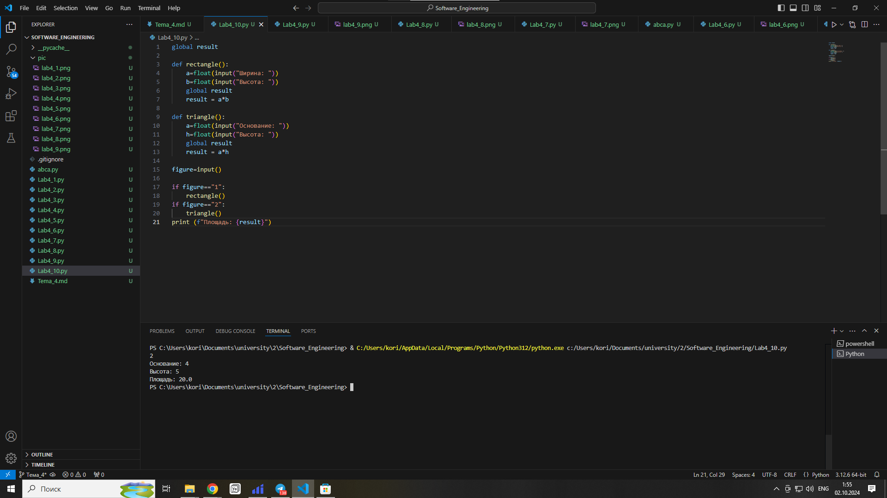

## Выводы
1. Глобальная переменная, это переменная, областью видимости которой является вся программа

## Самостоятельная работа №1
### Дайте подробный комментарий для кода, написанного ниже. Комментарий нужен для каждой строчки кода, нужно описать что она делает.

```python
from datetime import datetime  # Импортируем класс datetime из модуля datetime
from math import sqrt  # Импортируем функцию sqrt из модуля math

def calculate_distance(coordinates):  # Определяем функцию для расчета расстояния
    return sqrt(coordinates[0] ** 2 + coordinates[1] ** 2)  # Возвращаем корень суммы квадратов координат

def main(**kwargs):  # Определяем главную функцию с аргументами в виде кортежа
    results = {key: calculate_distance(value) for key, value in kwargs.items()}  # Используем словарь для хранения результатов
    for key, result in results.items():  # Перебираем результаты
        print(result)  # Выводим каждое значение на экран

if __name__ == '__main__':  # Проверяем, запущен ли файл напрямую
    start_time = datetime.now()  # Сохраняем текущее время
    main(one=[10, 3], two=[5, 4], three=[15, 13], four=[93, 53], five=[133, 15])  # Вызываем основную функцию
    time_costs = datetime.now() - start_time  # Вычисляем разницу времени
    print(f"Время выполнения программы: {time_costs}")  # Выводим время выполнения программы
```

### Результат.
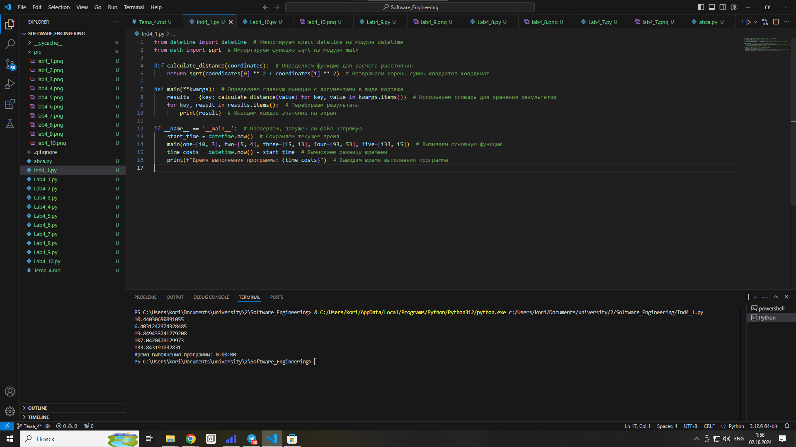

## Выводы
1. В языке python, комментарии обозначаются знаком #.

## Самостоятельная работа №2
### Напишите программу, которая будет заменять игральную кость с 6 гранями. Если значение равно 5 или 6, то в консоль выводится «Вы победили», если значения 3 или 4, то вы рекурсивно должны вызвать эту же функцию, если значение 1 или 2, то в консоль выводится «Вы проиграли». При этом каждый вызов функции необходимо выводить в консоль значение “кубика”. Для выполнения задания необходимо использовать стандартную библиотеку random. Программу нужно написать, используя одну функцию и “точку входа”.

```python
from random import randint

def cube(n):
    if n==5 or n==6:
        print(n)
        print("Вы победили")
    elif n==1 or n==2:
        print(n)
        print("Вы проиграли")
    else:
        print(n)
        cube(randint(1,6))

if __name__ == '__main__':
    cube(randint(1,6))
```

### Результат.
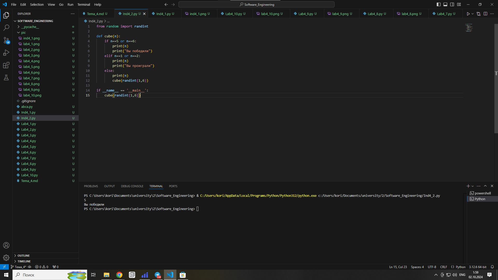

## Выводы
1. Библиотека ```random``` позволяет использовать рандомную генерацию

## Самостоятельная работа №3
### Напишите программу, которая будет выводить текущее время, с точностью до секунд на протяжении 5 секунд. Программу нужно написать с использованием цикла. Подсказка: необходимо использовать модуль datetime и time, а также вам необходимо как-то “усыплять” программу на 1 секунду.

```python
import datetime
import time
k = 5
while k != 0:
    ctime=datetime.datetime.now()
    print(ctime)
    k -= 1
    time.sleep(1)
```

### Результат.


## Выводы
1. Функция ```sleep``` позволяет "усыпить" программу на установленое количество времени

## Самостоятельная работа №4
### Напишите программу, которая считает среднее арифметическое от аргументов вызываемое функции, с условием того, что изначальное количество этих аргументов неизвестно. Программу необходимо реализовать используя одну функцию и “точку входа”.

```python
def main(*args):
    a=sum(args)
    b=len(args)
    return sum(args)/len(args)

if __name__ == '__main__':
    res=main(1,2,5,4,3,6,7,8,9,10)
    print(f"result={res}")
```

### Результат.
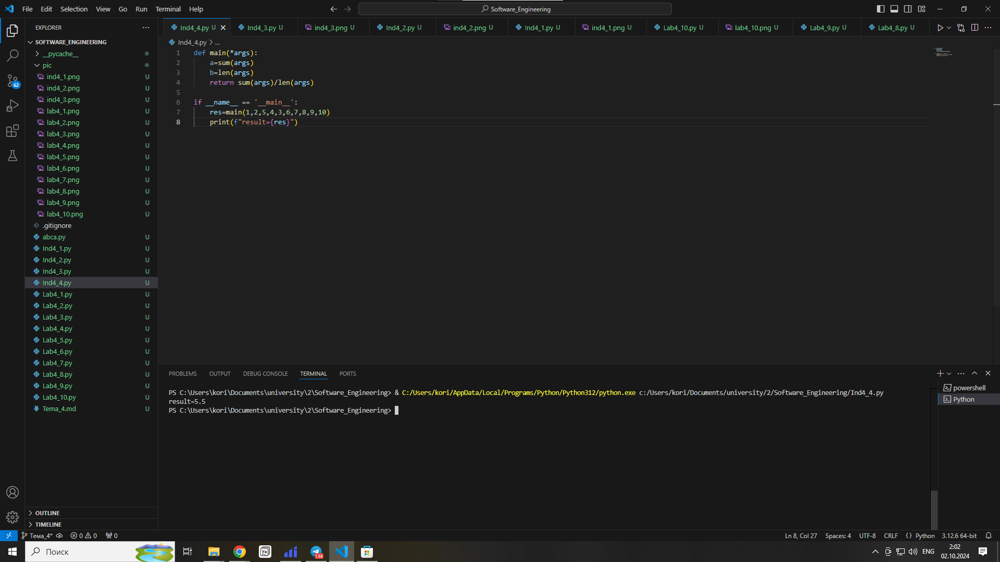

## Выводы
1. Кортеж ```*args``` позволяет передавать в функцию произвольное число параметров

## Самостоятельная работа №5
### Создайте программу из фрагментов кода

```python
from geron import geron

if __name__ == '__main__':
    a=int(input())
    b=int(input())
    c=int(input())
    res=geron(a,b,c)
    print(f"Площадь равна: {res}")
```

```python
from math import sqrt
def geron(a,b,c):
    p=(a+b+c)/2
    s=sqrt(p*(p-a)*(p-b)*(p-c))
    return s
```

### Результат.
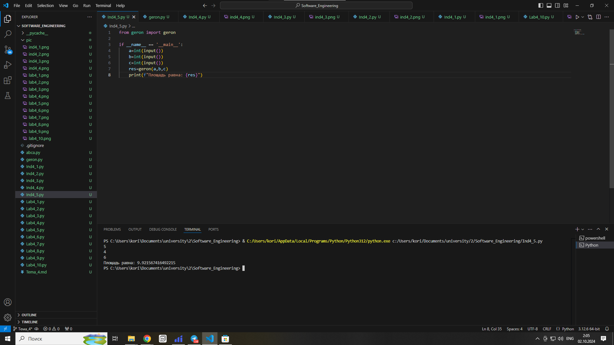

## Выводы
1. Функция ```sqrt``` позволяет находить квадратный корень заданного числа