# Тема 7. Работа с файлами (ввод, вывод) 
Отчет по Теме #7 выполнил:
- Самков Владислав Денисович
- ИВТ-22-2

| Задание | Лаб_раб | Сам_раб |
| ------ | ------ | ------ |
| Задание 1 | + | + |
| Задание 2 | + | + |
| Задание 3 | + | + |
| Задание 4 | + | + |
| Задание 5 | + | + |
| Задание 6 | + | - |
| Задание 7 | - | - |
| Задание 8 | + | - |
| Задание 9 | + | - |
| Задание 10 | + | - |

знак "+" - задание выполнено; знак "-" - задание не выполнено;

Работу проверили:
- к.э.н., доцент Панов М.А.

## Лабораторная работа №1
### Составьте текстовый файл и положите его в одну директорию с программой на Python. Текстовый файл должен состоять минимум из двух строк

### Результат.
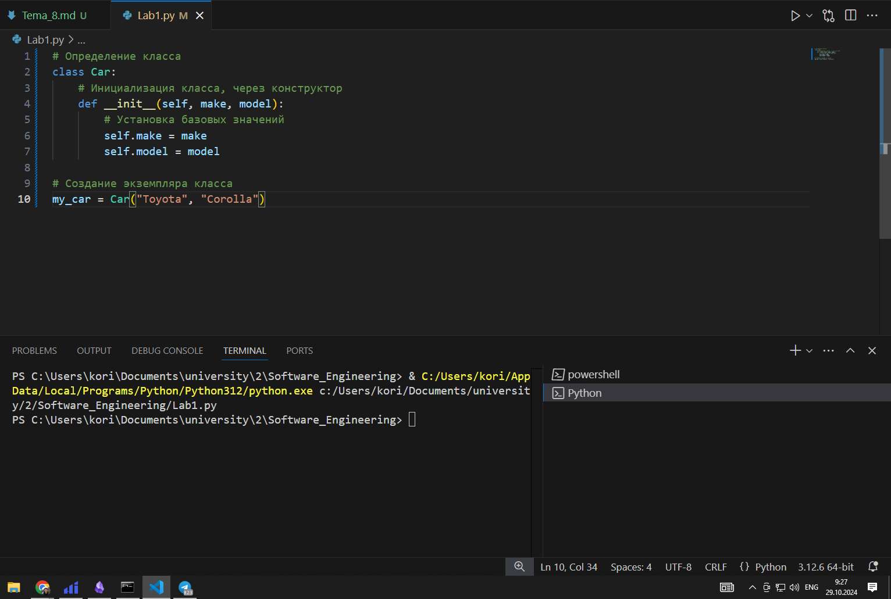

## Лабораторная работа №2
### Напишите программу, которая выведет только первую строку из вашего файла, при этом используйте конструкцию open()/close()

```python
f=open('input.txt','r')
print(f.readline())
f.close()
```

### Результат.


## Лабораторная работа №3
### Напишите программу, которая выведет все строки из вашего файла в массиве, при этом используйте конструкцию open()/close().

```python
f=open('input.txt','r')
print(f.readlines())
f.close()
```

### Результат.
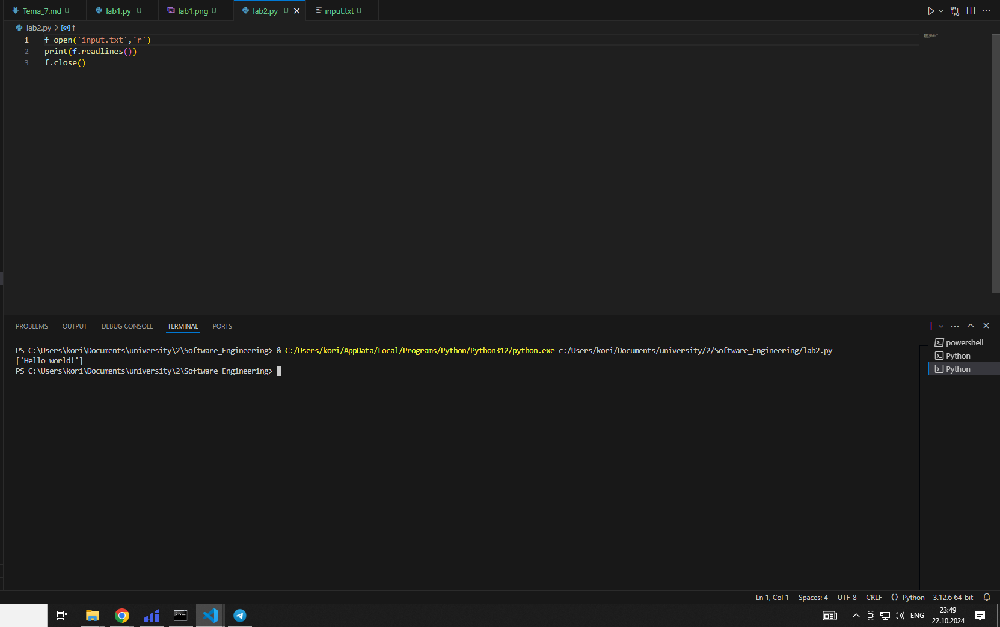

## Лабораторная работа №4
### Напишите программу, которая выведет все строки из вашего файла в массиве, при этом используйте конструкцию with open()

```python 
with open('input.txt') as f:
    print(f.readlines())
```

### Результат.
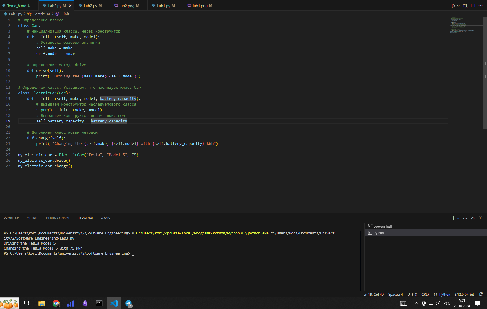

## Лабораторная работа №5
### Напишите программу, которая выведет каждую строку из вашего файла отдельно, при этом используйте конструкцию with open()

```python
with open('input.txt') as f:
    for line in f:
        print(line)
```

### Результат.
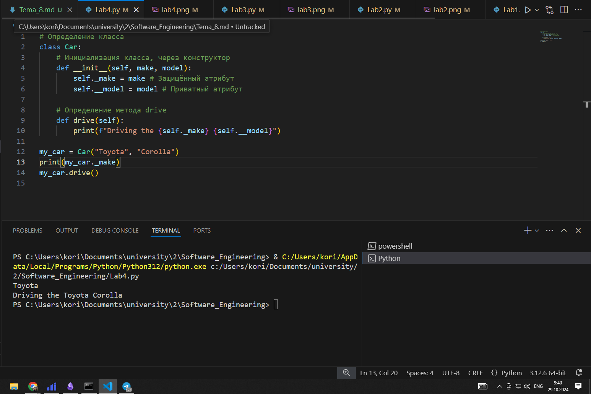

## Лабораторная работа №6
### Напишите программу, которая будет добавлять новую строку в ваш файл, а потом выведет полученный файл в консоль. Вывод можно осуществлять любым способом. Обязательно проверьте сам файл, чтобы изменения в нем тоже отображались

```python
with open('input.txt','a+') as f:
    f.write('\nAdd line')

with open('input.txt','r') as f:
    result=f.readlines()
    print(result)
```

### Результат.
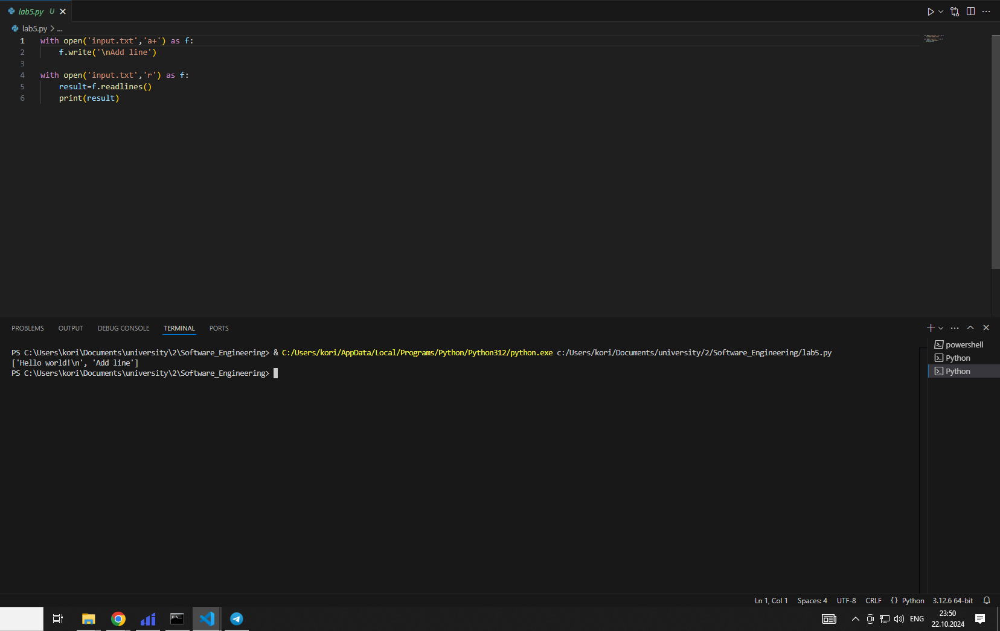

## Лабораторная работа №7
### Напишите программу, которая перепишет всю информацию, которая была у вас в файле до этого, например напишет любые данные из произвольно вами составленного списка. Также не забудьте проверить что измененная вами информация сохранилась в файле

```python
lines=['one','two','three']
with open ('input.txt','w') as f:
    for line in lines:
        f.write('\nLine number ' + line)
    print('Done')
```

### Результат.


## Лабораторная работа №9
### Документ «input.txt» содержит следующий текст: 
-Приветствие
-Спасибо 
-Извините 
-Пожалуйста 
-До свидания 
-Ты готов?
-Как дела?
-С днем рождения! 
-Удача!
-Я тебя люблю.
Требуется реализовать функцию, которая выводит слово, имеющее максимальную длину (или список слов, если таковых несколько).
Проверьте работоспособность программы на своем наборе данных

```python
def longest_word(file):
    with open(file, encoding='utf-8') as f:
        words=f.read().split()
        max_length=len(max(words, key=len))
        for word in words:
            if len(word)==max_length:
                sought_words=word
            
        if len(sought_words)==1:
            return sought_words[0]
        return sought_words

print(longest_word('input.txt'))
```

### Результат.
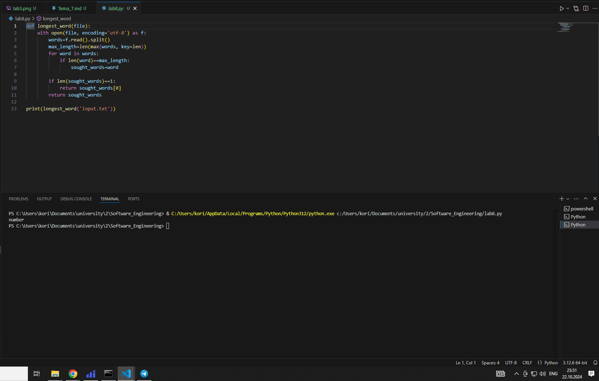

## Лабораторная работа №10
### 10)	Требуется создать csv-файл «rows_300.csv» со следующими столбцами:
•	№ - номер по порядку (от 1 до 300);
•	Секунда – текущая секунда на вашем ПК;
•	Микросекунда – текущая миллисекунда на часах.
Для наглядности на каждой итерации цикла искусственно приостанавливайте скрипт на 0,01 

```python
import csv
import time
import datetime

with open('rows_300.csw', 'w', encoding='utf-8', newline='') as f:
    writer=csv.writer(f)
    writer.writerow(['№','Секунда','Микросекунда'])
    for line in range(1, 301):
        writer.writerow([line, datetime.datetime.now().second, datetime.datetime.now().microsecond])
        time.sleep(0.01)
```

### Результат.
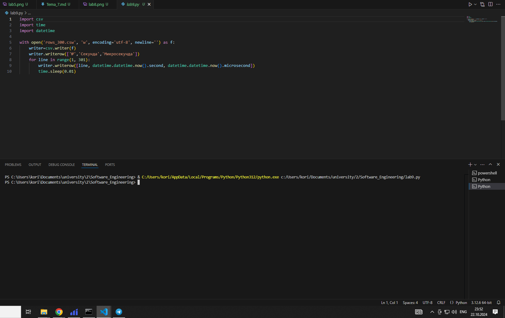

## Самостоятельная работа №1
### Найдите в интернете любую статью (объем статьи не менее 200 слов), скопируйте ее содержимое в файл и напишите программу, которая считает количество слов в текстовом файле и определит самое часто встречающееся слово. Результатом выполнения задачи будет: скриншот файла со статьей, листинг кода, и вывод в консоль, в котором будет указана вся необходимая информация

```python
from collections import Counter
x = open('input.txt', encoding='utf8').read()
c = Counter(x.split()) 
print(c.most_common()[:1])
```

### Результат.
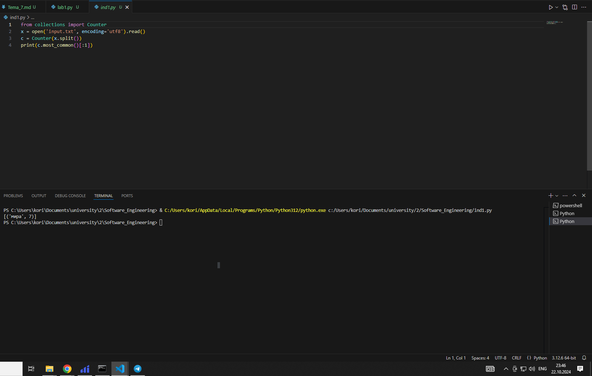

## Самостоятельная работа №2
### У вас появилась потребность в ведении книги расходов, посмотрев все существующие варианты вы пришли к выводу что вас ничего не устраивает и нужно все делать самому. Напишите программу для учета расходов. Программа должна позволять вводить информацию о расходах, сохранять ее в файл и выводить существующие данные в консоль. Ввод информации происходит через консоль. Результатом выполнения задачи будет: скриншот файла с учетом расходов, листинг кода, и вывод в консоль, с демонстрацией

```python
inp=input('Введите данные: ')
with open('expenses.txt','a+') as f:
    f.write('\n'+inp)

with open('expenses.txt','r') as f:
    result=f.readlines()
    print(result)
```

### Результат.
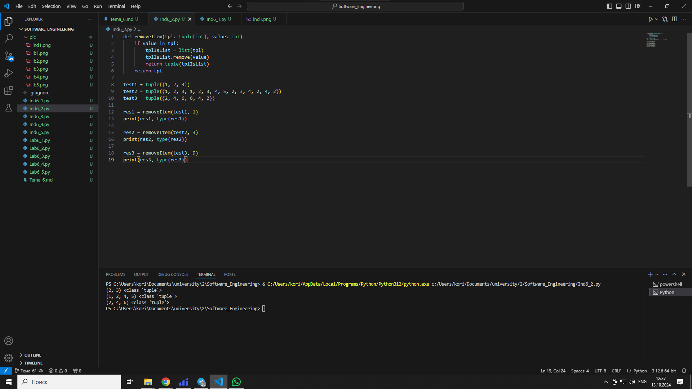

## Самостоятельная работа №3
### Имеется файл input.txt с текстом на латинице. Напишите программу, которая выводит следующую статистику по тексту: количество букв латинского алфавита; число слов; число строк.

```python
with open('input1.txt') as f:
	txt = f.read()
	print('Input file contains:')
	print(sum(map(str.isalpha, txt)), 'letters')
	print(len(txt.split()), 'words')
	print(txt.count('\n') + 1, 'lines')
```

### Результат.
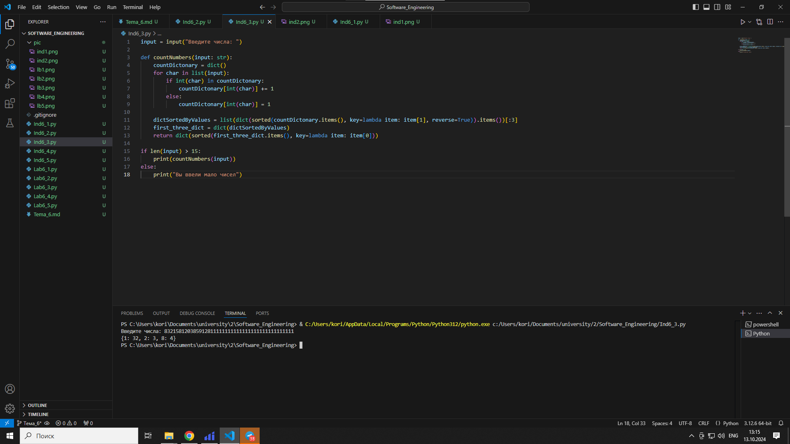

## Самостоятельная работа №4
### Напишите программу, которая получает на вход предложение, выводит его в терминал, заменяя все запрещенные слова звездочками * (количество звездочек равно количеству букв в слове). Запрещенные слова, разделенные символом пробела, хранятся в текстовом файле input.txt. Все слова в этом файле записаны в нижнем регистре. Программа должна заменить запрещенные слова, где бы они ни встречались, даже в середине другого слова. Замена производится независимо от регистра: если файл input.txt содержит запрещенное слово exam, то слова exam, Exam, ExaM, EXAM и exAm должны быть заменены на ****

```python
with open ('input1.txt','r', encoding='utf-8') as f:
    ifc=f.read()

with open('fwords.txt', 'r', encoding='utf-8') as fwords:
    fwl=fwords.read().split()

def find_substr(line, word):
    ind=[]
    t_line=line.lower()
    i=0
    while i<len(t_line):
        j=t_line.find(word,i)
        if j==-1:
            break
        ind.append(j)
        i=j+len(word)
    return ind

out_content=ifc

for word in fwl:
    ind=find_substr(out_content, word)

    for index in ind:
        out_content=(out_content[:index]+'*'*len(word)+out_content[index+len(word):])

print(out_content)
```

### Результат.
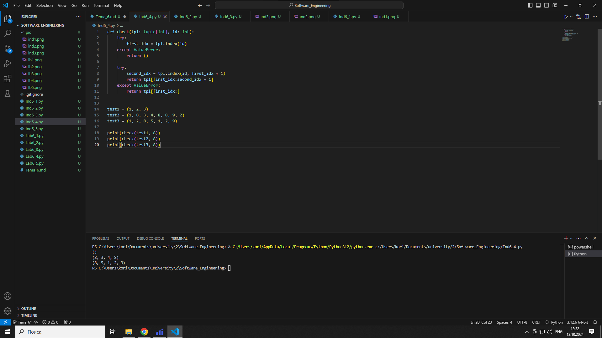

## Самостоятельная работа №5
### Самостоятельно придумайте и решите задачу, которая будет взаимодействовать с текстовым файлом

```python
def longest_word(file):
    with open(file, encoding='utf-8') as f:
        words=f.read().split()
        max_length=len(max(words, key=len))
        for word in words:
            if len(word)==max_length:
                sought_words=word
            
        if len(sought_words)==1:
            return sought_words[0]
        return sought_words

print(longest_word('input.txt'))
```

### Результат.
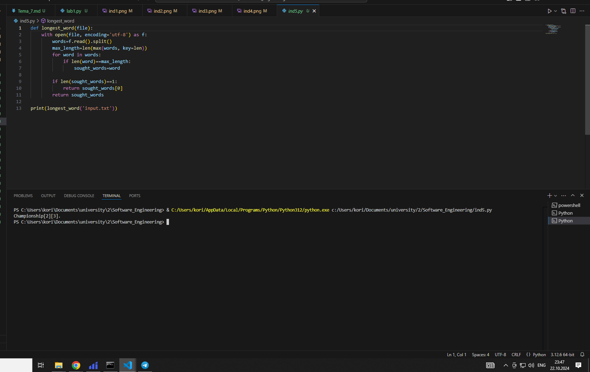