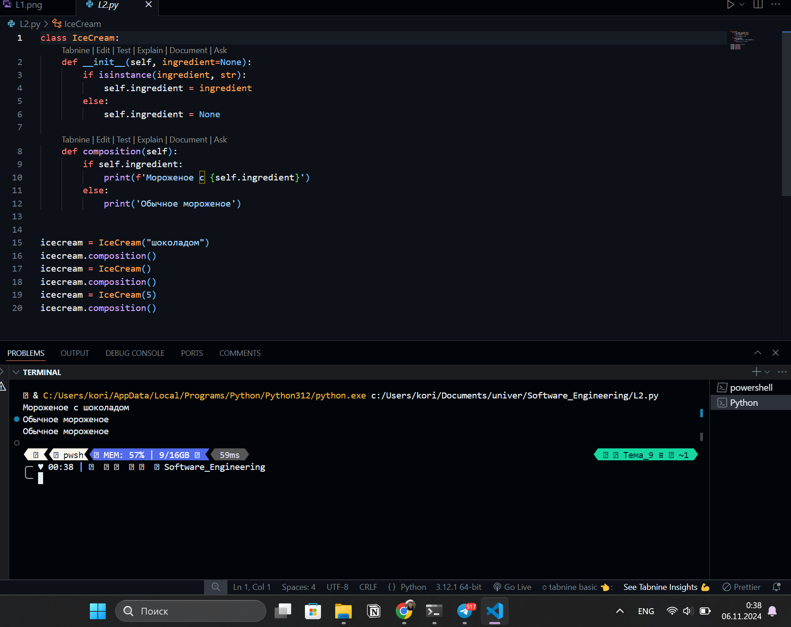
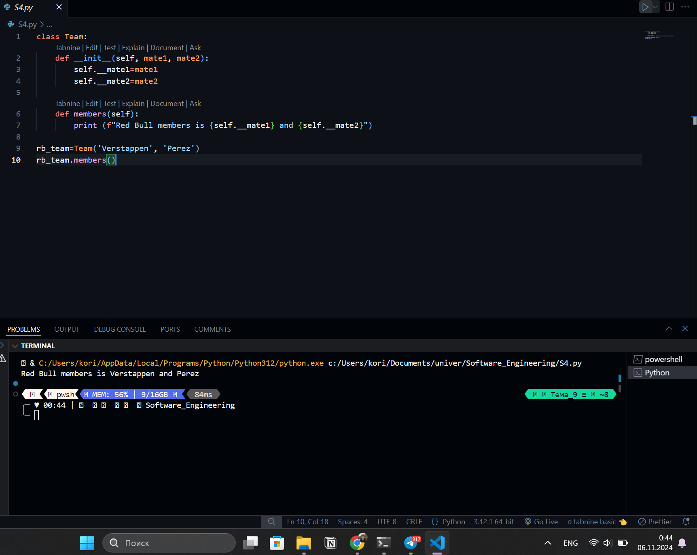

# Тема 9. Концепции и принципы ООП 
Отчет по Теме #9 выполнил:
- Самков Владислав Денисович
- ИВТ-22-2

| Задание | Лаб_раб | Сам_раб |
| ------ | ------ | ------ |
| Задание 1 | + | + |
| Задание 2 | + | + |
| Задание 3 | + | + |
| Задание 4 | + | + |
| Задание 5 | + | + |

знак "+" - задание выполнено; знак "-" - задание не выполнено;

Работу проверили:
- к.э.н., доцент Панов М.А.

## Лабораторная работа №1
### Допустим, что вы решили оригинально и немного странно познакомится с человеком. Для этого у вас должен быть написан свой класс на Python, который будет проверять угадал ваше имя человек или нет. Для этого создайте класс, указав в свойствах только имя. Дальше создайте функцию  init (), а в ней сделайте проверку на то угадал человек ваше имя или нет. Также можете проверить что будет, если в этой функции указав атрибут, который не указан в вашем классе, например, попробуйте вызвать фамилию

```python
class Petr:
    __slots__ = ["name"]
    def __init__(self, name):
        if name == "Пётр":
            self.name = f"Да, я {name}"
        else:
            self.name = f"Нет, я не {name}, а Пётр"

person1 = Petr("Петров")
person2 = Petr("Пётр")
print(person1.name)
print(person2.name)
```

### Результат.


## Лабораторная работа №2
### Вам дали важное задание, написать продавцу мороженого программу, которая будет писать добавили ли топпинг в мороженое и цену после возможного изменения. Для этого вам нужно написать класс, в котором будет определяться изменили ли состав мороженого или нет. В этом классе  реализуйте  метод,  выводящий  на  печать  «Мороженое с {ТОППИНГ}» в случае наличия добавки, а иначе отобразится следующая фраза: «Обычное мороженое». При этом программа должна воспринимать как топпинг только атрибуты типа string


```python
class IceCream:
    def __init__(self, ingredient=None):
        if isinstance(ingredient, str):
            self.ingredient = ingredient
        else:
            self.ingredient = None

    def composition(self):
        if self.ingredient:
            print(f'Мороженое с {self.ingredient}')
        else:
            print('Обычное мороженое')


icecream = IceCream("шоколадом")
icecream.composition()
icecream = IceCream()
icecream.composition()
icecream = IceCream(5)
icecream.composition()
```

### Результат.


## Лабораторная работа №3
### Петя – начинающий программист и на занятиях ему сказали реализовать икапсу…что-то. А вы хороший друг Пети и ко всему прочему прекрасно знаете, что икапсу…что-то – это инкапсуляция, поэтому решаете помочь вашему другу с написанием класса с инкапсуляцией. Ваш класс будет не просто инкапсуляцией, а классом с сеттером, геттером и деструктором. После написания класса вам необходимо продемонстрировать что все написанные вами функции работают. Также вас необходимо объяснить Пете почему на скриншоте ниже в консоли выводится ошибка


```python
class MyClass:
    def __init__(self, value):
        self._value = value

    def set_value(self, value):
        self._value = value

    def get_value(self):
        return self._value

    def del_value(self):
        del self._value

    value = property(get_value, set_value, del_value, "Свойство value")


obj = MyClass(42)
print(obj.get_value())
obj.set_value(45)
print(obj.get_value())
obj.set_value(100)
print(obj.get_value())
obj.del_value()
print(obj.get_value()) #метод value удалён, потому и выводится ошибка
```

### Результат.


## Лабораторная работа №4
### Вам прекрасно известно, что кошки и собаки являются млекопитающими, но компьютер этого не понимает, поэтому вам нужно написать три класса: Кошки, Собаки, Млекопитающие. И при помощи “наследования” объяснить компьютеру что кошки и собаки – это млекопитающие. Также добавьте какой-нибудь свой атрибут для кошек и собак, чтобы показать, что они чем-то отличаются друг от друга


```python 
class Mammal:
    className = "Mammal"

class Dog(Mammal):
    species = "canine"
    sounds = "wow"
    LovedToy = "stick"

class Cat(Mammal):
    species = "feline"
    sounds = "meow"
    LovedToy = "rope"

dog = Dog()
print(f"Dog is {dog.className}, but it says {dog.sounds}. Dogs like to play with {dog.LovedToy}.")
cat = Cat()
print(f"Cat is {cat.className}, but it says {cat.sounds}. Cats like to play with {cat.LovedToy}.")
```

### Результат.


## Лабораторная работа №5
### 5)	На разных языках здороваются по-разному, но суть остается одинаковой, люди друг с другом здороваются. Давайте вместе с вами реализуем программу с полиморфизмом, которая будет описывать всю суть первого предложения задачи. Для этого мы можем выбрать два языка, например, русский и английский и написать для них отдельные классы, в которых будет в виде атрибута слово, которым здороваются на этих языках. А также напишем функцию, которая будет выводить информацию о том, как на этих языках здороваются.
Заметьте, что для решения поставленной задачи мы использовали декоратор @staticmethod, поскольку нам не нужны обязательные параметры-ссылки вроде self

```python
class Russian:
    @staticmethod
    def greeting():
        print("Привет")


class English:
    @staticmethod
    def greeting():
        print("Hello")


def greet(language):
    language.greeting()

ivan = Russian()
greet(ivan)
john = English()
greet(john)
```

### Результат.


## Самостоятельная работа
### Задания для самостоятельного выполнения:
Задание Садовник и помидоры.
Классовая структура:
Есть Помидор со следующими характеристиками:
•	Индекс
•	Стадия созревания (стадии: отсутствует, цветение, зеленый, красный)
Помидор может:
•	Расти (переходить на следующую стадию созревания)
•	Предоставлять информацию о своей зрелости

Есть Куст с помидорами, который:
•	Содержит список томатов, которые на нем растут А также может:
•	Расти вместе с томатами
•	Предоставлять информацию о зрелости всех томатов
•	Предоставлять урожай
И также есть Садовник, который имеет:
•	Имя
•	Растение, за которым он ухаживает Он может:
•	Ухаживать за растением
•	Собирать с него урожай

## Самостоятельная работа №1
### Вызовите справку по садоводству

```python
class Tomato:
    
    states = {'Отсутствует': 0, 'Цветение': 1, 'Зеленый': 2, 'Красный': 3}
    
    def __init__(self, index):
        self._index = index
        self._state = self.states['Отсутствует']
        
    def grow(self):
        if self._state < 3:
            self._state += 1
        
    def is_ripe(self):
        return True if self._state == 3 else False
 
class TomatoBush:
    
    def __init__(self, num):
        self.tomatoes = [Tomato(index) for index in range(1, num+1)]
        
    def grow_all(self):
        for tomato in self.tomatoes:
            tomato.grow()
            
    def all_are_ripe(self):
        return all([tomato.is_ripe() for tomato in self.tomatoes])
    
    def give_away_all(self):
        self.tomatoes = []
 
class Gardener:
    
    def __init__(self, name, plant):
        self.name = name
        self._plant = plant
        
    def work(self):
        self._plant.grow_all()
        
    def harvest(self):
        if self._plant.all_are_ripe():
            print('Урожай собран!')
            self._plant.give_away_all()
        else:
            print('Томаты еще не дозрели')
            
    @staticmethod
    def knowledge_base():
        print('Справка по садоводству:')
        print('1. Не забывайте регулярно поливать и подкармливать растения')
        print('2. Определите правильное расстояние между растениями, чтобы они не мешали друг другу в росте')
        print('3. Удалите поврежденные листья и плоды, чтобы предотвратить распространение болезней')
 
Gardener.knowledge_base()
```

### Результат.


## Выводы
1. В Python статические методы создаются с использованием декоратора @staticmethod, что позволяет вызывать метод без создания экземпляра класса.

## Самостоятельная работа №2
### Создайте объекты классов TomatoBush и Gardener

```python
class Tomato:
    
    states = {'Отсутствует': 0, 'Цветение': 1, 'Зеленый': 2, 'Красный': 3}
    
    def __init__(self, index):
        self._index = index
        self._state = self.states['Отсутствует']
        
    def grow(self):
        if self._state < 3:
            self._state += 1
        
    def is_ripe(self):
        return True if self._state == 3 else False
 
class TomatoBush:
    
    def __init__(self, num):
        self.tomatoes = [Tomato(index) for index in range(1, num+1)]
        
    def grow_all(self):
        for tomato in self.tomatoes:
            tomato.grow()
            
    def all_are_ripe(self):
        return all([tomato.is_ripe() for tomato in self.tomatoes])
    
    def give_away_all(self):
        self.tomatoes = []
 
class Gardener:
    
    def __init__(self, name, plant):
        self.name = name
        self._plant = plant
        
    def work(self):
        self._plant.grow_all()
        
    def harvest(self):
        if self._plant.all_are_ripe():
            print('Урожай собран!')
            self._plant.give_away_all()
        else:
            print('Томаты еще не дозрели')
            
    @staticmethod
    def knowledge_base():
        print('Справка по садоводству:')
        print('1. Не забывайте регулярно поливать и подкармливать растения')
        print('2. Определите правильное расстояние между растениями, чтобы они не мешали друг другу в росте')
        print('3. Удалите поврежденные листья и плоды, чтобы предотвратить распространение болезней')
 
bush = TomatoBush(5)
gardener = Gardener('John', bush)
```

### Результат.


## Выводы
1. Создание экземпляров классов TomatoBush и Gardener позволяет симулировать отношения между садовником и кустом томатов.

## Самостоятельная работа №3
### Используя объект класса Gardener, поухаживайте за кустом с помидорами

```python
class Tomato:
    
    states = {'Отсутствует': 0, 'Цветение': 1, 'Зеленый': 2, 'Красный': 3}
    
    def __init__(self, index):
        self._index = index
        self._state = self.states['Отсутствует']
        
    def grow(self):
        if self._state < 3:
            self._state += 1
        
    def is_ripe(self):
        return True if self._state == 3 else False
 
class TomatoBush:
    
    def __init__(self, num):
        self.tomatoes = [Tomato(index) for index in range(1, num+1)]
        
    def grow_all(self):
        for tomato in self.tomatoes:
            tomato.grow()
            
    def all_are_ripe(self):
        return all([tomato.is_ripe() for tomato in self.tomatoes])
    
    def give_away_all(self):
        self.tomatoes = []
 
class Gardener:
    
    def __init__(self, name, plant):
        self.name = name
        self._plant = plant
        
    def work(self):
        self._plant.grow_all()
        
    def harvest(self):
        if self._plant.all_are_ripe():
            print('Урожай собран!')
            self._plant.give_away_all()
        else:
            print('Томаты еще не дозрели')
            
    @staticmethod
    def knowledge_base():
        print('Справка по садоводству:')
        print('1. Не забывайте регулярно поливать и подкармливать растения')
        print('2. Определите правильное расстояние между растениями, чтобы они не мешали друг другу в росте')
        print('3. Удалите поврежденные листья и плоды, чтобы предотвратить распространение болезней')
 
bush = TomatoBush(5)
gardener = Gardener('John', bush)
 
gardener.work()
gardener.work()
gardener.work()
```

### Результат.


## Выводы
1. Метод work класса Gardener позволяет увеличивать стадии созревания томатов, симулируя уход за растениями.

## Самостоятельная работа №4
### Попробуйте собрать урожай, когда томаты еще не дозрели. Продолжайте ухаживать за ними

```python
class Tomato:
    
    states = {'Отсутствует': 0, 'Цветение': 1, 'Зеленый': 2, 'Красный': 3}
    
    def __init__(self, index):
        self._index = index
        self._state = self.states['Отсутствует']
        
    def grow(self):
        if self._state < 3:
            self._state += 1
        
    def is_ripe(self):
        return True if self._state == 3 else False
 
class TomatoBush:
    
    def __init__(self, num):
        self.tomatoes = [Tomato(index) for index in range(1, num+1)]
        
    def grow_all(self):
        for tomato in self.tomatoes:
            tomato.grow()
            
    def all_are_ripe(self):
        return all([tomato.is_ripe() for tomato in self.tomatoes])
    
    def give_away_all(self):
        self.tomatoes = []
 
class Gardener:
    
    def __init__(self, name, plant):
        self.name = name
        self._plant = plant
        
    def work(self):
        self._plant.grow_all()
        
    def harvest(self):
        if self._plant.all_are_ripe():
            print('Урожай собран!')
            self._plant.give_away_all()
        else:
            print('Томаты еще не дозрели')
            
    @staticmethod
    def knowledge_base():
        print('Справка по садоводству:')
        print('1. Не забывайте регулярно поливать и подкармливать растения')
        print('2. Определите правильное расстояние между растениями, чтобы они не мешали друг другу в росте')
        print('3. Удалите поврежденные листья и плоды, чтобы предотвратить распространение болезней')
 
bush = TomatoBush(5)
gardener = Gardener('John', bush)
 
gardener.work()

gardener.harvest()
```

### Результат.


## Выводы
1. При попытке собрать урожай, когда томаты ещё не дозрели, метод harvest выводит сообщение, что они ещё не готовы.

## Самостоятельная работа №5
### Соберите урожай

```python
class Tomato:
    
    states = {'Отсутствует': 0, 'Цветение': 1, 'Зеленый': 2, 'Красный': 3}
    
    def __init__(self, index):
        self._index = index
        self._state = self.states['Отсутствует']
        
    def grow(self):
        if self._state < 3:
            self._state += 1
        
    def is_ripe(self):
        return True if self._state == 3 else False
 
class TomatoBush:
    
    def __init__(self, num):
        self.tomatoes = [Tomato(index) for index in range(1, num+1)]
        
    def grow_all(self):
        for tomato in self.tomatoes:
            tomato.grow()
            
    def all_are_ripe(self):
        return all([tomato.is_ripe() for tomato in self.tomatoes])
    
    def give_away_all(self):
        self.tomatoes = []
 
class Gardener:
    
    def __init__(self, name, plant):
        self.name = name
        self._plant = plant
        
    def work(self):
        self._plant.grow_all()
        
    def harvest(self):
        if self._plant.all_are_ripe():
            print('Урожай собран!')
            self._plant.give_away_all()
        else:
            print('Томаты еще не дозрели')
            
    @staticmethod
    def knowledge_base():
        print('Справка по садоводству:')
        print('1. Не забывайте регулярно поливать и подкармливать растения')
        print('2. Определите правильное расстояние между растениями, чтобы они не мешали друг другу в росте')
        print('3. Удалите поврежденные листья и плоды, чтобы предотвратить распространение болезней')
 
bush = TomatoBush(5)
gardener = Gardener('John', bush)
 
gardener.work()
gardener.work()
gardener.work()

gardener.harvest()
```

### Результат.


## Выводы
1. Когда все томаты созрели, метод harvest успешно собирает урожай, очищая список томатов на кусте.
